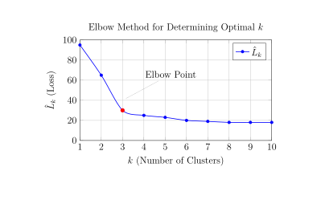

# Week 12

## Unsupervised Learning

Recall that in supervised learning, we have a data set $\left(x^{(1)}, y^{(1)} \right), \dots, \left(x^{(n)}, y^{(n)} \right)$ and we predict $y_*$ using $x_*$. In unsupervised learning, we no longer have $y$, and just get a data set $x^{(1)}, \dots, x^{(n)}\in \mathbb{R}^p$. The goal is to learn about the distribution of $x$'s.  

Two examples for why unsupervised learning is useful: 

- Market Segmentation: A company selling a product might want to divide their customer base into different groups. Specifically, if we have features $x^{(i)}$ for customer $i$, we want t o divide customers into certain blocks only using $x^{(i)}$'s. 

- Initial Feature Transformation: Another example to do unsupervised learning can be an initial feature transformation step in a supervised learning pipeline.

$$
x \rightarrow \phi(x) \rightarrow \begin{aligned}
    &\text{Using this an input into} \\
    &\text{a supervised learning model}
\end{aligned}
$$

where $\phi(x)$ is a feature transformation. For example, we can use PCA to reduce the dimensionality of the data before applying a supervised learning model.

## Clustering

Intuitively, we want to divide points into clusters: 

- Points in the same cluster should be close. 
- Points in different clusters  should be far away from each other. 

### K-Means

Fix $K$ to be the number of clusters. The way we do K-means clustering is by defining a clustering assignment map:

$$
f:\{1, \dots, n\} \rightarrow\{1, \dots, K\}
$$

where $n \geq K$ is the number of data points, $x^{(i)}$. Assume that each cluster has a center or mean $\mu_j\in \mathbb{p}$, $j=1,\dots, K$. We want to minimize the loss function:

$$
L\left(f, \mu_1, \dots, \mu_k\right)=\sum_{i=1}^n \left\|x^{(i)}-\mu_{f(i)}\right\|^2,
$$

where $\left\|x^{(i)}-\mu_j\right\|^2$ is the squared distance between the data point and the cluster center. We want to minimize this loss function over all possible assignments $f$ and all possible cluster centers $\mu_1,\dots,\mu_K$, usually iteratively (like backfitting)(1). 
{.annotate}

1. We first fix $\mu_j$ and find the optimal $\hat{f}$, then fix $f=\hat{f}$ and find the optimal $\hat{\mu}_j$'s. Then, fix the $\mu_j=\hat{\mu}_j$ 's and find the optimal $\hat{f}$ again, and so on until convergence.

**Fix $\mu_1,\dots,\mu_K$, and find the optimal $f$:** We just find the optimal value of $f(i)\in \{1,\dots,K\}$ for every $i = 1,\dots,n$, that is to minimize 

$$
\left\|x^{(i)}-\mu_{f(i)}\right\|^2.
$$

We simply assign point $x^{(i)}$ to the closest cluster $\mu_j$, $j=1,\dots, K$. 

**Fix $f$, and find the optimal $\mu_j$:** As $\mu_j$ only appears in the $i$-th term if $f(i) = j$, we just minimize 

$$
\hat{\mu}_j = \operatorname*{arg\, min}_{\mu_j} \sum_{i\mid f(i)=j} \left\|x^{(i)}-\mu_{j}\right\|^2.
$$

Taking the gradient to be 0, we have

$$
\sum_{i\mid f(i)=j} x^{(i)} = \sum_{i\mid f(i)=j} \mu_j = \mu_j\cdot \hat{n}_j, 
$$

where $\hat{n}_j$ is the number of data points assigned to cluster $j$. Therefore, 

$$
\hat{\mu}_j = \frac{1}{\hat{n}_j} \sum_{i\mid f(i)=j} x^{(i)}. 
$$

Note that the loss function $L\left(f, \mu_1, \dots, \mu_k\right)$ is non-convex and thus, it has local but not global minima: 

- The result of our algorithm is sensitive to the choice of starting values for $\mu_1,\dots,\mu_K$. 
- It is a good idea to run the algorithm multiple times with different starting points. 

### Scaling Features 

Scaling of the features in K-means is important. Usually we will center and rescale them by the feature's standard deviation. We define

$$
\bar{x}=\frac{1}{n} \sum x^{(i)}
$$

and we then map $x^{(i)} \mapsto x^{(i)}-\bar{x}$. Then for each feature $j$, we scale by $\hat{\sigma}$.

$$
\hat{\sigma}_j=\frac{1}{\sqrt{n}} \sqrt{\sum_{i=1}^{n}\left(x^{(i)}_j-\bar{x}\right)^2}.
$$

And so we obtain 

$$
x^{(i)}-\bar{x} \mapsto \frac{x^{(i)}-\bar{x}}{\hat{\sigma}_j}
$$ 

for each feature. 

### Choosing the Number of Clusters

For unsupervised learning, cross-validation generally doesn't work. The elbow method is a way to determine the number of clusters $K$. Previously we wanted to minimize

$$
L\left(f, \mu_1, \dots, \mu_k\right)=\sum_{j=1}^K \sum_{i\mid f(i)=j}\left\|x^{(i)}-\mu_j\right\|^2,
$$

where $f$ is the assignment function and $\mu_j$ is the cluster center.

For any $K$ define 

$$
\hat{L}_k=\min _{f, \mu_1, \dots, \mu_k} \sum_{j=1}^K \sum_{i\mid f(i)=j}\left\|x^{(i)}-\mu_j\right\|^2.
$$ 

As $K$ gets larger, then $\hat{L}_k$ should decrease. In the extreme case where $K=n$, $\hat{L}_n=0$.

Plot $\hat{L}_k$ vs. $K=1,2, \dots, n$, and look at the succesive differences of $\hat{L}_k$, i.e. $\hat{L}_k - \hat{L}_{K+1}$. Ideally what we want is that the first few clusters drop a lot (lower loss), but then as we add additional clusters, the decrease in loss is smaller.

The way we can determine where the elbow is to find the largest difference. It is also useful to regenerate the plot of $\hat{L}_k$ vs. $K$ multiple times if possible to account for any convergence issues.

### Hierarchical Clustering

Hierarchical clustering is to fit a sequence of cluster assignments, which allows for a "continuous" $K$ to be chosen. Here we introduce agglomerative hierarchical clustering, which starts with $n$ clusters, then sequentially fuse the clusters together until we have one.

The way to merge the clusters is to use a notion of dissimilarity between clusters. There are various choices for dissimilarity measures.

**Average Linkage:** The dissimilarity between two clusters is defined as the average distance(1) between all pairs of points. More precisely,
{.annotate}

1. This is not necessary to be a distance, i.e. it may not satisfy the triangle inequality, such as $\|x-y\|^2$. In fact, any $f(|x-y|)$, $x,y\in\mathbb{R}^p$, where $f$ is a monotone increasing function of the Euclidean norm, can induce a dissimilarity measure between clusters by using the maximum, average or minimum values of this quantity between pairs of points in clusters.

$$
d_{\mathrm{avg}}\left(C_1, C_2\right)=\frac{1}{\left|C_1\right| \cdot\left|C_2\right|} \sum_{x \in C_1} \sum_{y \in C_2} d(x, y)
$$

where $C_1$ and $C_2$ are the two clusters, $d(x, y)$ is the distance between points $x$ and $y$, and $\left|C_1\right|$ and $\left|C_2\right|$ are the sizes of the clusters. Usually we take $d(x, y)=\|x-y\|^2$.(1)
{.annotate}

1. Suppose we have DNA sequences from different organisms. We often use the Hamming distance (see [Problem 3,(b)](stat541_assignment3.md#assignment-3)) to cluster them based on their similarity. Using these distances, we can construct a dendrogram to visualize the evolutionary relationships between the organisms. The sequences with smaller Hamming distances will be clustered together first, reflecting their closer evolutionary relationship.

**Complete Linkage:** The dissimilarity between two clusters is defined as the maximum distance between any pair of points. More precisely, 

$$
d_{\mathrm{com}}\left(C_1, C_2\right)=\max _{x \in C_1, y \in C_2} d(x, y).
$$

**Single Linkage:** Instead of considering the furthest points, we consider the closest points between two clusters. The dissimilarity is defined as:

$$
S\left(C_1, C_2\right)=d_{\text {single }}\left(C_1, C_2\right)=\min _{x \in C_1, y \in C_2} d(x, y). 
$$

Complete linkage tends to give more balanced clusters, and single linkage tends to give less balanced, long, "chain-like" clusters. Average linkage is somewhere in between.

Algorithm for Hierarchical Clustering: At every step we want to find two clusters, $C_i, C_j$, that minimize $d\left(C_i, C_J\right)$. Where the clusters are obtained from the previous step.

### Dendrograms 

A dendrogram (generally depicted as an upside-down tree) is built starting from the leaves and combining clusters up to the trunk(1). In this, the horizontal axis represents the individual data points or clusters, and the vertical axis shows the dissimilarity at which clusters were merged. See the below example. 
{.annotate}

1.  There are many ways to display the same dendrogram (i.e. you can permute the leaves)

- Left: a dendrogram obtained from hierarchically clustering. 
- Center: the dendrogram from the left-hand panel, cut at a height of nine (indicated by the dashed line). This cut results in two distinct clusters, shown in different colors. 
- Right: the dendrogram from the left-hand panel, now cut at a height of five. This cut results in three distinct clusters, shown in different colors. Note that the colors were not used in clustering, but are simply used for display purposes in this figure.

**Choosing the Number of Clusters:** We can "cut" the dendrogram at the height where the largest vertical gap occurs, as this indicates a natural separation between clusters.

**Example** (Hamming Distance on DNA Sequencing): Suppose we have DNA sequences from different organisms, and we want to cluster them based on their similarity. One way to measure similarity is the Hamming distance, which counts the number of positions at which the corresponding nucleotides differ between two sequences.(1) Using these distances, we can construct a dendrogram to visualize the evolutionary relationships between the organisms. The sequences with smaller Hamming distances will be clustered together first, reflecting their closer evolutionary relationship.
{.annotate}

1. For example, consider the following DNA sequences: $\displaystyle {\mathrm S1:}\ ACGTAC,\ {\mathrm S2:}\  ACGTTC,\ {\mathrm S3:}\ ACGGAC$. The Hamming distances are: $d(S1,S2) = 1$ (only the fifth nucleotide differs), $d(S1,S3) = 1$ (only the fourth nucleotide differs), and $d(S2,S3) = 2$ (the fourth and fifth nucleotides differ).

We can also look at divisive clustering, which is the opposite to the agglomerative clustering techniques we have looked at so far. The idea is to start with one big cluster, then split it into two smaller clusters, then continue splitting until each point is in its own cluster.

## Gaussian Mixture Models (GMM)

K-Means did a "hard assignment" at points to clusters, i.e. each point is assigned to a single cluster. GMM, on the other hand, is a "soft assignment" algorithm, in that a point can be assigned to multiple clusters according to a probability.

A GMM assumes that the data is generated from a mixture of $K$ Gaussian distributions. The idea is to choose the cluster centers, and assign a multivariate Gaussian distribution at each cluster center. More precisely, the data generating mechanism for $x$: 

1. Roll a $K$ sided dice with probability of each side $\pi_1,\dots,\pi_K$, i.e. draw $z \sim {\rm Multinomial}_K(\boldsymbol{\pi},1)$. 
2. If $z=j$, where $j=1,\dots,K$, then draw $x$ from the distribution $\mathcal{N}_p\left(\mu_j,\sigma_j^2I_p\right)$. 

Therefore, the probability density function for a point $x$ is given by:

$$
p(x)=\sum_{j=1}^K \pi_j p\left(x \mid \mu_j, \sigma_j^2\right). 
$$

We assume that the data we observe $x^{(1)},\dots,x^{(n)}$ are all generated i.i.d. from this process, although we don't know the parameters $\boldsymbol{\pi},\mu_1,\dots,\mu_K,\sigma_1^2,\dots,\sigma_K^2$. 

### Estimate the Parameters

The likelihood for a single $x^{(i)}$ is

$$
\begin{aligned}
p\left(x^{(i)}\right) & =\sum_{j=1}^k p\left(x^{(i)}, z_i=j\right) \\
& =\sum_{j=1}^k p\left(x^{(i)} \mid z_i=j\right) p\left(z_i=j\right) \\
& =\sum p_{\mathcal{N}_j}\left(x^{(i)}\right) \pi_j, 
\end{aligned}
$$

where $p_{\mathcal{N}_j}$ is the pdf of the multivariate normal distribution $\mathcal{N}_p\left(\mu_j,\sigma_j^2I_p\right)$. Using MLE, we want to maximize

$$
\log \left(\prod_{i=1}^n p\left(x^{(i)} \mid \pi, \mu_1, \ldots, \mu_k, \sigma_1^2, \ldots, \sigma_k^2\right)\right)
$$

with respect to $\boldsymbol{\pi},\mu_1,\dots,\mu_K,\sigma_1^2,\dots,\sigma_K^2$.  EM algorithm to maximize GMM's 

We can use the expectation maximization (EM) algorithm to find the MLEs since there is no closed form solution if we try to differentiate and solve algebraically. (As the loss function can be non-convex, the EM algorithm can find local minima but not necessary a global minimum.)

### EM Algorithm

Define the responsibility of cluster $j$ to the data point $i$ as

$$
\hat{r}_{i j}=\frac{\hat{\pi}_j \hat{p}_{\mathcal{N}_j}\left(x^{(i)}\right)}{\sum_{l=1}^k \hat{\pi_l} \hat{p}_{\mathcal{N}_l}\left(x^{(i)}\right)},
$$

which can be interpreted as the current estimate of the probability that $x^{(i)}$ was generated from cluster $j$. This is based on the estimators $\hat{\boldsymbol{\pi}},\hat{\mu}_1,\dots,\hat{\mu}_K,\hat{\sigma}_1^2,\dots,\hat{\sigma}_K^2$ from previous step of the algorithm. 

**E-step:** Compute the responsibilities $r_{i j}$ for all $i$ and $j$ (note that because these responsibilities are probabilities, that $\sum_{j=1}^K r_{i j}=1$ ). 

**M-step:** Update the parameters as follows:

$$
\begin{aligned}
\pi_j & =\frac{\hat{n}_j}{n} \\
\mu_j & =\frac{\sum_{i=1}^n \hat{r}_{i j} x^{(i)}}{\hat{n}_j} \\
\sigma_j^2 & =\frac{1}{\hat{n}_j}\sum_{i=1}^n \hat{r}_{i j}\cdot \frac{1}{p}\left\|x^{(i)}-\mu_j\right\|^2
\end{aligned}
$$

where $p$ is the dimensionality of $x^{(i)}$ and $\hat{n}_j=\sum_{i=1}^n \hat{r}_{i j}$.

Since we are modeling a probability distribution, we can generate new data from $p(x)=\sum_j p(x \mid z=j)\cdot p(z=j)$ (e.g. a very simple case of generative AI). We can also modify the Gaussian assumption very easily: $x^{(i)} \mid z=j \sim N\left(\mu_j, \Sigma_j\right)$ for a general covariance matrix instead, and we can still model using a similar process to find the right estimates for $\mu_j, \Sigma_j, \pi$. 

Finally, we can approximate any continuous probability density function using a mixture model, if we take our value $K$ to be large enough (i.e. as long as we have enough clusters we can capture a lot of the behavior of the probability density).
