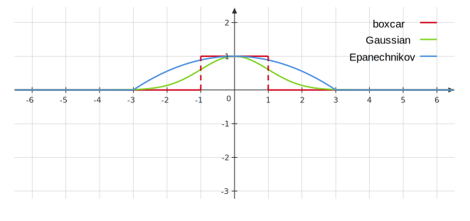

# Week 8

## Spline

Recall the linear regression model

$$
f(x)=\sum_{i=0}^p \beta_i f_i(x), 
$$

where the $f_i$'s are simply feature transformations of $x$. We will now want to consider different feature transformations and even optimize over the $f_i$'s. (As an example, recall that in polynomial regression we essentially had $\left.f_1(x)=1, f_2(x)=x, \dots, f_i(x)=x^{p}\right)$. 

The idea for splines is to fit two polynomial regressions on different pieces of the data. Then we will connect them in a nice way.

### Basis Function

The idea is to have at hand a family of functions or feature transformations that can be applied to a variable $X$ : $b_1(X), b_2(X), \dots, b_K(X)$. Instead of fitting a linear model in $X$, we fit the model

$$
y^{(i)}=\beta_0+\beta_1 b_1\left(x^{(i)}\right)+\beta_2 b_2\left(x^{(i)}\right)+\beta_3 b_3\left(x^{(i)}\right)+\cdots+\beta_K b_K\left(x^{(i)}\right)+\epsilon_i
$$

Note that the basis functions $b_1(\cdot), b_2(\cdot), \ldots, b_K(\cdot)$ are fixed and known. For polynomial regression, the basis functions are $b_j\left(x^{(i)}\right)=\left(x^{(i)}\right)^j$, and for piecewise constant functions they are $b_j\left(x^{(i)}\right)=I\left(c_j \leq x^{(i)}<c_{j+1}\right)$. 

To fit two polynomial regressions on different pieces of the data, we consider basis functions:

$$
\beta_0 I(x<\theta)+\beta_1 I(x<\theta) x+\beta_2 I(x<\theta) x^2+\tilde{\beta}_0 I(x\geq\theta)+\tilde{\beta}_1 I(x\geq\theta) x+\tilde{\beta}_2 I(x\geq\theta) x^2
$$

This is not necessarily continous at $\theta$ though, and we would ideally want a continous function. For example, we consider the linear case, 

$$
\beta_0 I(x<\theta)+\beta_1 I(x<\theta) x+\tilde{\beta}_0 I(x\geq\theta)+\tilde{\beta}_1 I(x\geq\theta) x
$$

### Linear, Quadratic, and Cubic Spline

We can introduce the function $z_{+}=\max \{0, z\}$, and then consider the function $f(x)=$ $\beta_0+\beta_1 x+\beta_2(x-\theta)_{+}$

**Linear Spline:** A linear spline with knots at $\theta_1, \ldots, \theta_l$ is a function of the form

$$
f(x)=\beta_0+\beta_1 x+\beta_2(x-\theta)_{+}+\cdots+\beta_{l+1}\left(x-\theta_l\right)_{+}.
$$

This would essentially connect the two linear regressions with a line. 

We would like to make piecewise polynomials that are both continous and differentiable. So we can move to quadtratic functions.

**Quadratic Spline:** A quadratic spline with knots at $\theta_1, \ldots, \theta_l$ is a function of the form

$$
f(x)=\beta_0+\beta_1 x+\beta_2 x^2 + \beta_3(x-\theta)_{+}^2+\cdots+\beta_{l+2}\left(x-\theta_l\right)_{+}^2
$$

**Cubic Spline:** A cubic spline with knots at $\theta_1, \ldots, \theta_l$ is a function of the form

$$
f(x)=\beta_0+\beta_1 x+\beta_2 x^2+\beta_3 x^3 + \beta_4(x-\theta)_{+}^3+\cdots+\beta_{l+3}\left(x-\theta_l\right)_{+}^3
$$

Quadratic splines are continous and differentiable, but people generally use cubic splines. Cubic splines ensure that $f$ is continous and has second order derivatives. This makes the cubic spline flexible and often less variable than fitting high degree polynomials.

The next question is how do we choose the knots, $\theta_i$ ?

### Knot Selection

We may look at the plot and pick the points where the "behavior" of the points changes. More formally, we may take the following steps: 

1. Pick nots at the quantiles or percentiles of $x^{(1)},\dots,x^{(n)}$. 
2. Decide how many knots to choose -- look at AIC or BIC and do model selection: 
    - Compute the AIC of a model with and without a knot and compare the models to determine if we need it. 
3. Use cross-validation to select between candidate knot choices. 

For AIC/BIC, we need the number of parameters(1): if no constraints, there are $4(l+1)$; there are 3 constraints(2) at each knot; therefore, there are $l+4$ parameters. 
{.annotate}

1. Here we consider cubic spline with $l$ knots.
2. Three constraints: continuous, continuous first and second order derivatives. 

We can use something called smoothing splines to improve this process. 

## Smoothing Splines

We will first start off with the optimization problem $\left(x, x^{(i)} \in \mathbb{R}\right)$ :

$$
\hat{f}(x)=\operatorname*{arg\, min} _f \left(\sum_{i=1}^n\left(f\left(x^{(i)}\right)-y^{(i)}\right)^2+\lambda \int_{-\infty}^{\infty}\left(f^{\prime \prime}(x)\right)^2 d x\right),
$$

where $\lambda$ is a fixed smoothing parameter. The first term measures closeness to the data, while the second term penalizes curvature in the function, and $\lambda$ establishes a tradeoff between the two(1). 
{.annotate}

1. The penalty is 0 for linear functions of $f$. If our function has curvature, the penalty applies, and the penalty will be larger for more 'wiggly' functions. 

Two special cases are:

- $\lambda=0: f$ can be any function that interpolates the data.
- $\lambda=\infty$ : the simple least squares line fit, since no second derivative can be tolerated.

**Remarkable result:** The minimizer of the optimization problem is a (regularized) natural cubic spline with knots (at every data point): $\theta_1=x^{(1)},\dots, \theta_n=x^{(n)}$. 

**Natural Cubic Splines:** A natural cubic spline is a cubic spline that is linear beyond the boundary knots, given by 

$$
f^{\prime \prime}(x)=0 \quad \text { for } x<\theta_1 \text { or } x>\theta_m. 
$$

Similarly to cubic splines, natural cubic splines can be represented with a basis 

$$
f(x)=\sum_{i=1}^m \beta_i f_i(x). 
$$

For natural cubic splines with $m$ knots, the number of parameters is $m$ -- recall a cubic spline with $m$ knots has $m+4$ parameters, and in a natural cubic spline, we have 4 boundary constraints (2(1) on each side), so it will have $m$ parameters.
{.annotate}

1. Two constraints: second and third order derivative being 0 at the boundary. 

Since we are putting a knot at every single data point, one would think we would have a very wiggly curve. However, we use the idea of regularization to mitigate this. First we will plug the basis functions into the minimization problem, and we have a minimization problem over the $\beta_i$'s:

$$
\begin{aligned}
\hat{f}(x) & =\operatorname*{arg\, min} _{\beta_1, \ldots, \beta_m} \sum_{i=1}^n\left(\sum_{j=1}^m \beta_j f_j\left(x^{(i)}\right)-y^{(i)}\right)^2+\lambda \int\left(\sum_{j=1}^m \beta_j f_j^{\prime \prime}(x)\right)^2 d x \\
& =\operatorname*{arg\, min} _{\beta_1, \ldots, \beta_m} \sum_{i=1}^n\left(\sum_{j=1}^m \beta_j f_j\left(x^{(i)}\right)-y^{(i)}\right)^2+\lambda \int\left(\sum_{k=1}^m \sum_{j=1}^m \beta_j \beta_k f_k^{\prime \prime}(x) f_j^{\prime \prime}(x)\right) d x \\
& =\operatorname*{arg\, min} _{\beta_1, \ldots, \beta_m} \sum_i\left(\sum_j \beta_j f_j\left(x^{(i)}\right)-y^{(i)}\right)^2+\lambda \int\left(\beta_j \beta_k \sum_k \sum_j f_k^{\prime \prime}(x) f_j^{\prime \prime}(x)\right) d x. 
\end{aligned}
$$

Define a $m\times m$ matrix $\Omega$ with $\Omega_{ij}=\int f^{\prime \prime}_i f^{\prime \prime}_j \,\mathrm{d}x$, and a design matrix

$$
X=\begin{bmatrix}
f_1\left(x^{(1)}\right) & f_2\left(x^{(1)}\right) & \ldots & f_m\left(x^{(1)}\right) \\
f_1\left(x^{(2)}\right) & f_2\left(x^{(2)}\right) & \ldots & f_m\left(x^{(2)}\right) \\
\vdots & \vdots & \ddots & \vdots \\
f_1\left(x^{(n)}\right) & f_2\left(x^{(n)}\right) & \ldots & f_m\left(x^{(n)}\right)
\end{bmatrix},
$$

and let $\boldsymbol{\beta}=\left(\beta_1, \ldots, \beta_m\right)^T$. Then the optimization problem becomes

$$
\operatorname*{arg\, min} _{\boldsymbol{\beta}}\|Y-X \boldsymbol{\beta}\|^2+\lambda \boldsymbol{\beta}^T \Omega \boldsymbol{\beta},
$$

and thus this implies that

$$
\hat{\boldsymbol{\beta}}_{\rm smoothing spline }=\left(X^T X+\lambda \Omega\right)^{-1} X^T Y. 
$$

### Degrees of Freedom and Smoother Matrices

We have not yet indicated how $\lambda$ is chosen for the smoothing spline. To illustrate the meaning of $\lambda$, we first recall in linear regression (with $p$ features), where predictions at observed points are

$$
\hat{Y}=X \hat{\beta}=X \left(X^T X\right)^{-1} X^T Y. 
$$

We can interpret each $\hat{Y}_i$ as a linear combination of the $y^{(i)}$ 's(1), i.e. $\hat{Y}_i=\sum_{j=1}^n H_{i j} Y_j$, where 
{.annotate}

1. If $H_{i i} \approx 1, H_{i j: i \neq j} \approx 0$, we can interpolate the data points for a flexible fit.

$$
H = X \left(X^T X\right)^{-1} X^T. 
$$

Recall for any two square matrices, we have $\operatorname{tr}(AB) = \operatorname{tr} (BA)$. Then we have 

$$
\operatorname{tr}(H)=\operatorname{tr}\left(X\left(X^T X\right)^{-1} X^T\right)=\operatorname{tr}\left(\left(X^T X\right)^{-1} X^T X\right)=p,
$$

which is the number of parameters. We will call the $\operatorname{tr}(H)$ as the number of effective parameters(1).  By analogy we now define the number of effective parameters (a.k.a. the effective degrees of freedom) of a smoothing spline. 
{.annotate}

1. The linear operator $H$ is a projection operator, also known as the hat matrix in statistics. The expression $\operatorname{trace}\left(H\right)$ gives the dimension of the projection space, which is also the number of basis functions, and hence the number of parameters involved in the fit. 

For smoothing splines, we have 

$$
\hat{\beta}=\left(X^T X+\lambda \Omega\right)^{-1} X^T Y \Longrightarrow \hat{Y}=X \hat{\beta}=X\left(X^T X+\lambda \Omega\right)^{-1} X^T Y. 
$$

We define the smoothing matrix, $S_\lambda=X\left(X^T X+\lambda \Omega\right)^{-1} X^T$, so that we have: $\hat{Y}=S_{\lambda} Y$. The effective number of parameters is $\operatorname{tr}\left(S_{\lambda}\right)$, which generalizes the result for linear regression. Also note that the effective degrees of freedom here may not be an integer. 

The effective degrees of freedom(1) is a heuristic parameter count, which helps us compare the smoothing splines with other regression models, like polynomial regression. 
{.annotate}

1. Although a natural cubic spline with $n$ knots has $n$ parameters, the penalty term in the [minimization problem](stat541_week8.md#smoothing-splines) regularizes the minimizer resulting in the smoothing spline has less than $n$ effective number of parameters. 

### Summary

Overall smoothing splines provide nice and flexible fits and the choice of $\lambda$ is straightforward as we don't have to choose knot locations. 

The main drawback is that the design matrix $X=\in \mathbb{R}^{n\times n}$, so if $n$ is large then computing $\left(X^TX + \lambda\Omega\right)^{-1}$ is expensive. In polynomial regression, the number of features, $p$, does not depend on $n$, but for smoothing splines it does.  

## Extensions

**MARS:** Consider interaction effects for multivariate features. MARS use basis functions of the form of products of $\left(x_i-\theta_i\right)_{+}$. For example, we can form basis functions over $p=2$ of the form: 

$$
f\left(x_1, x_2\right)=\left(x_1-\theta_1\right)_{+}\cdot\left(x_2-\theta_2\right)_{+}. 
$$

**Logistic Regression:** Splines can also be used in logistic regression. All we need to do is change our basis functions:

$$
\ln \left(\frac{p(x)}{1-p(x)}\right)=\sum_{i=1}^l \beta_i f_i(x),
$$

where we choose a spline basis for $f_i$. 

## Kernel Smoothing and Regression

With smoothing splines we would try to fit a polynomial over each fixed window determined by the knots. For kernel method we will instead use a window that slides based on the point $x_*$ where we want to make a prediction. We can then predict $y_∗$ by averaging over all points in our window. Here we introduce the boxcar kernel function $K_\lambda:\mathbb{R}\times\mathbb{R}\rightarrow [0,\infty)$, given by 

$$
K_\lambda(x,y) = I(|x-y|\leq \lambda). 
$$

Then we make prediction at $x_*$ via

$$
\begin{aligned}
\hat{f}\left(x_*\right) & =\text { Average of } y^{(i)} \text { for } x^{(i)} \in\left[x_*-\lambda, x_*+\lambda\right] \\
& =\frac{\sum y^{(i)} I\left(-\lambda \leq x_*-x^{(i)} \leq \lambda\right)}{\sum I\left(-\lambda \leq x_*-x^{(i)} \leq \lambda\right)} \\
& =\frac{\sum K_\lambda\left(x^{(i)}, x_*\right) y^{(i)}}{\sum K_\lambda\left(x^{(i)}, x_*\right)}. 
\end{aligned}
$$

### General Kernel Smoothing

With the boxcar kernel the whole fit can be jagged because of the discontinuity of the kernel. Rather than give all the points in the neighborhood equal weight, we can assign weights that die off smoothly with distance from the target point: 

- Gaussian Kernel: $\displaystyle K_\lambda(x, y)=\exp \left(\frac{-(x-y)^2}{\lambda}\right)$. 
- Epanechnikov kernel: $\displaystyle K_\lambda(x, y)=\left(1 - \left(\frac{x-y}{\lambda}\right)^2\right)_+$. 

The following figure shows the images of boxcar kernel with $K_1(x,0)$, Gaussian kernel with $K_2(x,0)$, and Epanechnikov kernel $K_3(x,0)$. 

The interpretation of kernel $K_\lambda(x, y)$ is that it measures how similar or close $x$ is to $y$. Generally, kernels have the form:

$$
K_\lambda(x, y)=f\left(\frac{|x-y|}{\lambda}\right),
$$

where $f$ is non-increasing and non-negative. $\lambda$ is called the bandwidth parameter and determines the spread of the kernel. 

The general kernel smoothed prediciton is defined as:

$$
\hat{f}\left(x_*\right)=\frac{\sum_{i=1}^n y^{(i)} K_\lambda\left(x_*, x^{(i)}\right)}{\sum_{i=1}^n K_\lambda\left(x_*, x^{(i)}\right)}. 
$$

If we define a function $w_i\left(x_*\right)=\frac{K_\lambda\left(x_*, x^{(i)}\right)}{\sum_{i=1}^n K_\lambda\left(x_*, x^{(i)}\right)}$, we have a bunch of weights that sum to 1 , i.e., $\sum w_i\left(x_*\right)=1$, and $w_i \geq 0$. Thus, the kernel smoother is:

$$
\hat{f}\left(x_*\right)=\sum_{i=1}^n w_i\left(x_*\right) y^{(i)}. 
$$

### Effective Degrees of Freedom

The choice of kernel function is actually not super important, but **the choice of the bandwidth parameter is important:** Large $\lambda$ implies lower variance (averages over more observations) but higher bias(1). Small $\lambda$ gives the opposite.
{.annotate}

1. we essentially assume the true function is constant within the window. 

Note that the predictions at our observed data points, $x^{(i)}$ have the form

$$
\hat{y}_i=\hat{f}\left(x^{(i)}\right)=\sum_{j=1}^n w_j\left(x^{(i)}\right) y^{(i)}, 
$$

which holds for all $i=1, \ldots, n$. Thus,

$$
\hat{Y}=\begin{bmatrix}
w_1\left(x_1\right) & w_2\left(x_1\right) & \cdots & w_n\left(x_1\right) \\
w_1\left(x_2\right) & w_2\left(x_2\right) & \cdots & w_n\left(x_2\right) \\
\vdots & \vdots & \ddots & \vdots \\
w_1\left(x_n\right) & w_2\left(x_n\right) & \cdots & w_n\left(x_n\right)
\end{bmatrix} \begin{bmatrix}
y_1 \\
y_2 \\
\vdots \\
y_n
\end{bmatrix}
$$

Usually we can just call the weight matrix $W$. Thus, we have that $\hat{Y}=W Y$. We define a similar notion of the effective degrees of freedom for kernel smoothing as we did for splines:

$$
\operatorname{tr}(W)=\sum_{i=1}^n w_i\left(x^{(i)}\right). 
$$

This can be thought of as the approximation of how many parameters are in the model.
