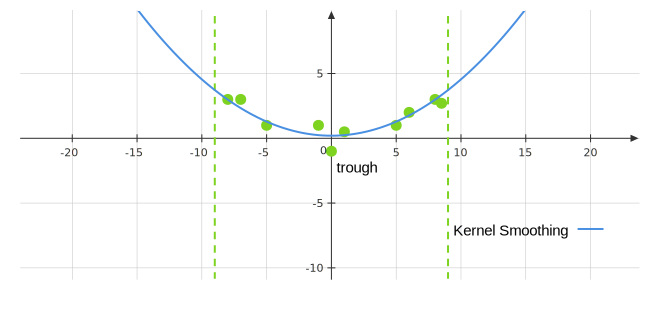

# Week 9

## Local Polynomial Regression

We can think of local polynomial regression as a generalization of kernel smoothing. Given an $x_*$, we want to find $\hat{\beta}_0\left(x_*\right)$ and $\hat{\beta}_1\left(x_*\right)$ using least squares, but we only include data points within a $\lambda$-window of $x_*$. We can write this as:

$$
\min _{\beta_0, \beta_1} \sum_{i=1}^n K_\lambda\left(x_*, x^{(i)}\right)\left(y^{(i)}-\beta_0-\beta_1\left(x_*\right)\right)^2
$$

Once we find $\hat{\beta}_0\left(x_*\right)$, and $\hat{\beta}_1\left(x_*\right)$, we can predict 

$$
\hat{f}\left(x_*\right)=\hat{\beta}_0\left(x_*\right)+\hat{\beta}_1\left(x_*\right)\left(x_*\right)
$$

We do not need to necessarily use a boxcar kernel, we can use any kernel function. We can also incorporate polynomial fits. 

### General Formulation of Local Polynomial Regression

Consider

$$
\begin{aligned}
&\left(\hat{\beta}_0\left(x_*\right), \hat{\beta}_1\left(x_*\right), \dots, \hat{\beta}_d\left(x_*\right)\right) \\
&=\operatorname*{arg\, min}_{\beta_0, \dots, \beta_d} \sum_{i=1}^n K_\lambda\left(x_*, x^{(i)}\right)\left(y^{(i)}-\beta_0-\beta_1\left(x^{(i)}\right)-\dots-\beta_d\left(x^{(i)}\right)^d\right)^2.
\end{aligned}
$$

The prediction is given by 

$$
\hat{f}\left(x_*\right)=\hat{\beta}_0\left(x_*\right)+\sum_{i=1}^d \hat{\beta}_i\left(x_*\right) x_*^i.
$$

The optimization is a weighted least squares problem, which we can formulate by defining $X$ to be the polynomial regression design matrix:

$$
K=\begin{bmatrix}
K_\lambda\left(x_1, x_*\right) & \dots & 0 \\
\vdots & \vdots & \vdots \\
0 & \dots & K_\lambda\left(x_n, x_*\right)
\end{bmatrix}
$$

Then the optimization problem is the same as 

$$
\operatorname*{arg\, min}_\beta(Y-X \beta)^T K(Y-X \beta),
$$ 

where the minimizer is given by

$$
\hat{\beta}=\left(X^T K X\right)^{-1} X^T K Y. 
$$

###  Advantages of Local Regression

- Fit has less bias than kernel smoothing as kernel smoothing will trim peaks and troughs. As averaging the data points within the window, the prediction made by kernel smoothing will be smaller than the highest (larger than the smallest) points, while local regression may achieve lower bias at the minimum or maximum points. 

- A local quadratic regression will have less bias as we fit a quadratic polynomial in the window. 
- Kernel smoothing fails at picking up boundary trends. As kernel smoothing continues linearly, local regression is a bit better. The following figure shows when outside the boundary, kernel smoothing can only will undershoot the trend while local (polynomial) regression can avoid this issue. 

## K-Nearest Neighbors Regression

We want to make a prediction at a point, $x_∗ \in \mathbb{R}$. We will look at the training set, $x^{(1)},\dots,x^{(n)}$ and find the $K$ observations that are closest (smallest values of $|x_*-x^{(i)}|$) to $x_∗$. We can then predict $y_∗$ by averaging over the $K$ observations. In this, $K$ plays a similar role to $\lambda$ in a kernel smoother since it determines the complexity.

### Motivation

If we have a lot of data, and we apply a kernel smoother to one region in the data, where there are sparse amounts of points, only a few points will be captured by the weighting (because the kernel function is small). This gives us a pretty variable fit around that particular region (high variance). In another region where we have lots of points densley sampled, we might want the bandwidth of the kernel to be smaller. That is, we want to use different bandwidths based on how many points are nearby, which is effectively what KNN does. It can be viewed as a kernel smoother where the bandwidth, $\lambda$ depends on $x_*$. 

### KNN as a Smoothing Kernel
1. Define the distance metric, $d\left(x^{(i)}, x_*\right)=\left|x^{(i)}-x_*\right|$.
2. Assume $d\left(x^{(1)}, x_*\right) \leq d\left(x^{(2)}, x_*\right) \leq \ldots \leq d\left(x^{(n)}, x_*\right)$.
3. Let $\lambda\left(x_*\right)=d\left(x^{(K)}, x_*\right)$.
4. Define the kernel function as:

$$
\begin{aligned}
\hat{f}_{\mathrm{KNN}}\left(x_*\right)
&=\frac{\sum_{i=1}^n I\left(d\left(x^{(i)},x_*\right) \leq \lambda\left(x_*\right)\right) y^{(i)}}{\sum_{i=1}^n I\left(d\left(x^{(i)},x_*\right) \leq \lambda\left(x_*\right)\right)} \\
&=\frac{1}{K}\sum_i I\left(d\left(x^{(i)},x_*\right) \leq \lambda\left(x_*\right)\right) y^{(i)}. 
\end{aligned}
$$

We can then write,

$$
\hat{Y}=\begin{bmatrix}
\frac{1}{K} & 0 & \cdots & \frac{1}{K} & 0 & \cdots & 0 \\
0 & \frac{1}{K} & \cdots & 0 & \frac{1}{K} & \cdots & 0 \\
\vdots & \vdots & \ddots & \vdots & \vdots & \vdots & \vdots \\
\vdots & \vdots & \vdots & \vdots & \ddots & \vdots & \vdots \\
\frac{1}{K} & 0 & \cdots & \frac{1}{K} & 0 & \cdots & \frac{1}{K}
\end{bmatrix} \begin{bmatrix}
y^{(1)} \\
y^{(2)} \\
\vdots \\
\vdots \\
y^{(n)}
\end{bmatrix},
$$

where this matrix is symmetric and has entries of 0 and $\frac{1}{K}$(1), and there are only $\frac{1}{K}$ on the diagonal. This is a very sparse matrix. The effective degrees of freedom is 
{.annotate}

1. Each row (or column) has $n-K$ entries of 0 and $K$ entries of $\frac{1}{K}$. In general, the weighting matrix will not have strings of repeated $\frac{1}{K}$ in the rows, there may be intermittent 0's.

$$
\operatorname{tr}(W)=\frac{n}{K}. 
$$

This suggests that $K$ should scale proportionally to $n$ to prevent overly complex fits. 

### Advantages of KNN

- With enough data can fit any function and give very flexible fits (may need lots of data). 

- Interpretable (e.g. KNN is easy to make sense of because we’re just taking the $K$ nearest data points and averaging them). 

## Multivariate Feature Spaces

### Multivariate KNN

In KNN, to extend to spaces beyond the real line, we simply need to introduce a distance over the feature space, $d(x, y)$, for any $x, y \in \mathbb{R}^p$. If we take $d$ to be Euclidean distance, we can compute

$$
d_i\left(x_i, x_*\right)=\left\|x_i-x_*\right\|
$$

to find the K-smallest $d_i$ 's and the prediction is the average.

### Multivariate Kernel Smoothing

We can extend the notion of our Kernel function to the multivariate setting:

$$
K_\lambda: \mathbb{R}^{p}\times \mathbb{R}^{p} \rightarrow[0, \infty)
$$

Often times the multivariate kernel has the form

$$
K\left(\frac{\|\boldsymbol{x}-\boldsymbol{y}\|}{\lambda}\right). 
$$

FOr example, the **Gaussian Kernel (a.k.a. Radial Basis-Function, RBF)** is defined as

$$
K_\lambda(x, y)=\exp \left(-\frac{\|\boldsymbol{x}-\boldsymbol{y}\|^2}{\lambda}\right). 
$$

The kernel smoother predicts 

$$
\hat{f}(x_*) = \frac{\sum_{i=1}^n K_{\lambda}(x_*,x^{(i)})y^{(i)}}{\sum_{i=1}^n K_{\lambda}(x_*,x^{(i)})}. 
$$

### Scaling

In multivariate kernels or distances, **scaling of features** is very important. For example, suppose we have information about a player (Scottie Barnes) from the Toronto Raptors. Say his salary is 5 Million CAD, and his height is 200 cm, and we don't know his points. We can find the 'closest' player on the Raptors to him by using the Euclidean distance from the point $(5000000,200)$, where the first component is salary, and the second is heights in cm. The issue with this approach is that the salary is much greater than the height, so any distances we compute will only really be affected by the salaries, since they are so much bigger. We need to scale our data by its standard deviation to account for this.

We will scale every feature, $x_i$ by its standard deviation.

###  Classification

It turns out that splines, local regression, and KNN can extend to classification settings.

- For splines and local regression, we can combine them with logistic regression to solve classification problems, i.e. fitting the [log-odds ratio](stat541_week5.md#motivation-and-interpretation) using splines and local regression. 

- For KNN, just predict the class that appears most often when looking at the $K$-nearest neighbors. We can use this to define a decision boundary by computing the KNN at every point in the plane (assume $p=2$). 

## Memory-Based Method

The methods, KNN, smoothing splines, and local regression, are memory-based, which means the algorithm "memorize" the entire training data set when making predictions(1). The computational complexity of making a new prediction for memory-based methods is $O(n)$(2). 
{.annotate}

1. For example, for KNN, we can't throw away any data point as it may the nearest neighbor. 
2. KNN need to query $O(n)$ data points to find the nearest neighbors. 

On the other hand, linear regression only requires the coefficients $\hat{\beta}_0,\dots,\hat{\beta}_p$ to make predictions, which compresses the training data into $p+1$ parameters. Then the computational complexity is roughly $O(p)$. 

Therefore, in terms of making predictions on-the-fly, memory-based methods are not always the best since the computation will be expensive if $n$ is large. 

### Curse of Dimensionality

Curse of dimensionality occurs when the features are too many. In high dimensions, there are a few points that are close to each other(1). Thus, it is impossible to simultaneously maintain localness (i.e. low bias) and a sizable sample in the neighborhood (i.e. low variance) as the dimension increases, without **the total sample size increasing exponentially** in $p$(2).
{.annotate}

1. For $p=1$, let $x$ be a uniform random variable on $[0,1]$ and we consider the distance between 0 and $x$. The probability of $x\in [0,\epsilon]$ is $\epsilon$. For higher dimension $p=k$, the probability of the uniform variable $x$ being in $[0,\epsilon]^k$ becomes $\epsilon^k$, which shows points that are within $\epsilon$-distance to 0 is getting less when the space dimension grows. 
2. Conversely, if we increase the number of features without adding new data to training set, the predictions made by our model would likely be worse. 
 
## Generalized Additive Models (GAMs)

Additive models provide a useful extension of linear models, making them more flexible while still retaining much of their interpretability. These allow aus to model complex univariate relationships (with multivariates features). 

Assume that there are no interaction effects and a GAM assumes 

$$
f(x_1,\dots,x_p) = \sum_{i=1}^p f_i(x_i), 
$$

where we allow for complicated non-parametric $f_i$, for instance, $f_i$ are smoothing splines or local regression. Note that 

$$
\frac{\partial}{\partial x_i} \frac{\partial}{\partial x_j} f(x_1,\dots,x_p) = 0, \quad, \text{ for } i\neq j. 
$$

### Backfitting

The backfitting procedure for fitting these models is simple and modular, allowing one to choose a fitting method appropriate for each input variable.The procedure is given by following steps: 

1. Start off with a simple fit for $f(x_1,\dots,x_p)$, for instance, set this equal to $\displaystyle \frac{1}{n}\sum_{i=1}^{n} y^{(i)}$ (constant). 
2. Assume that we have fits for $\hat{f}_2(x_2),\dots,\hat{f}_p(x_p)$. To find the optimal $f_1$, define $\displaystyle \tilde{y}^{(i)} = y^{(i)} - \sum_{j=2}^{p} \hat{f}_j\left(x^{(i)}_j\right)$. 
3. Fit our $\hat{f}_1$ using the training data $\left(x_1^{(1)},\tilde{y}^{(1)}\right),\dots,\left(x_1^{(n)},\tilde{y}^{(n)}\right)$. 
4. To find $\hat{f}_2$ given $\hat{f}_1,\hat{f}_3,\dots,\hat{f}_p$, redefine $\displaystyle \tilde{y}^{(i)} = y^{(i)} - \hat{f}_1\left(x^{(i)}_1\right) - \sum_{j=3}^{p} \hat{f}_j\left(x^{(i)}_j\right)$. 
5. Fit our $\hat{f}_1$ using the training data $\left(x_2^{(1)},\tilde{y}^{(1)}\right),\dots,\left(x_2^{(n)},\tilde{y}^{(n)}\right)$.
6. Repeat this process for $\hat{f}_3,\hat{f}_4,\dots,\hat{f}_p$, and then come back to $\hat{f}_1$ and repeat the process. 

**Example:** If we wanted the $f_k$ to be smoothing splines, then the step becomes 

$$
f_k(x) = \sum_{i=1}^m \beta_i g_i(x_k),
$$

where $g_i$ is the spline basis functions. Obtain $\beta_i$ by solving the smoothing spline minimization problem:

$$
\left(\hat{\beta}_1,\dots, \hat{\beta}_m\right) = \operatorname*{arg\, min}_{\beta_1,\dots,\beta_m} \left(\sum_{i=1}^n \left(\tilde{y}^{(i)} - \sum_{j=1}^m \beta_j g_j(x^{(i)}_k)\right)^2 + \lambda\int_{-\infty}^{+\infty} \left(\sum_{j=1}^m \beta_j g^{\prime\prime}(x)\right)^2\,\mathrm{d}x\right). 
$$