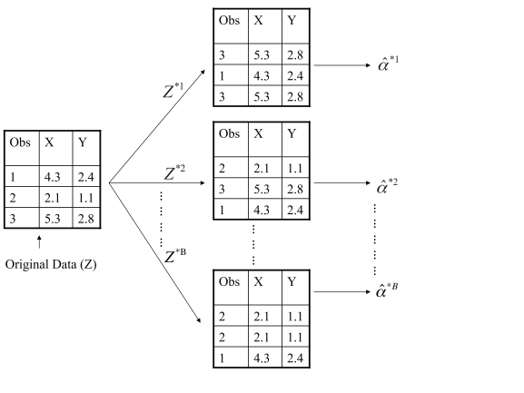

# Week 10

## Classification and Regression Trees

Recall [GAMs](stat541_week9.md#generalized-additive-models-gams) is complex univariate modelling, but no interaction effects between features. Here we introduce trees, which are simple univariate models (piecewise constant) but models interactions in a flexible manner. It can be motivated by a sequential decision making process:

$$
\begin{matrix}
\text{State } A \rightarrow & \text{State } B_1 \rightarrow &\text{State } C_1 \rightarrow & \text{State } D_1 \\
\downarrow & \downarrow  & \downarrow & \\
\text{State } B_2 & \text{State } C_2 & \text{State } D_2 \rightarrow & \text{State } E_1 \\
 & & \downarrow &  \\
 & & \text{State } E_2 & 
\end{matrix}
$$

where at each state, we make a decision and switch to the corresponding state. 

### Regression Tree

For a regression tree, our prediction function has the form

$$
f(x) = \sum_{i=1}^m \beta_i I(x\in R_i), 
$$

where $R_1,\dots,R_m$ are rectangles that partition $\mathbb{R}^p$. The following figure shows an example for $p=2$. 

If the rectangles are known, we simply estimate $\beta$ as: for each $1\leq j\leq m$, 

$$
\hat{\beta}_j = \frac{\sum_{i=1}^n I\left(x^{(i)}\in R_j\right)y^{(i)}}{\sum_{i=1}^n I\left(x^{(i)}\in R_j\right)}. 
$$

### Classification Tree

For classification, the prediction function (with $K$ classes) has the same form 

$$
f(x) = \sum_{i=1}^m \beta_i I(x\in R_i), 
$$

where $\beta_i\in \{1,\dots,K\}$. The estimation is given by 

$$
\hat{\beta}_j = \operatorname*{arg\, max}_{t\in \{1,\dots,n\}} \sum_{i=1}^n I\left(x^{(i)}\in R_j\right)\cdot I\left(y^{(i)} = t\right), 
$$

i.e. the majority vote of the data points located in $R_j$. 

### Partition Process

We recursively split the feature space $\mathbb{R}^p$ by directions that are parallel to the coordinates axis. Each split is chosen based on previous splits. The following figure shows an example of implementing 3 splits. 

If we regard each split as a decision making, then choosing the partition is the same as a sequential decision making process: 

$$
\begin{matrix}
R_{01}\,(\mathbb{R}^p) \rightarrow & R_{11} \rightarrow & R_{21} \rightarrow & R_{31} \\
\downarrow & \downarrow  & \downarrow & \\
R_{12} & R_{22} & R_{32} \rightarrow & R_{41} \\
 & & \downarrow &  \\
 & & R_{42} & 
\end{matrix}
$$

where $R_{ij}$ stands for the $j$-th part of the $i$-th split. 

### Impurity Measure

To specify each split, we need to tell whether a split is good(1) or not. Here we introduce an impurity measure that applies to the rectangles and our goal is to minimize the impurities. 
{.annotate}

1. Intuitively, a split is good when the data points within the rectangle have similar $y^{(i)}$ values. 

In regression, we just use MSE. Let $n_{ij}$ be the number of observations in rectangle $R_{ij}$. Then 

$$
{\rm Impurity}(R_{ij}) = \frac{1}{n_{ij}} \sum_{l\mid x^{(i)}\in R_{ij}} \left(y^{(l)} - \bar{y}_{ij}\right)^2,
$$

where $\bar{y}_{ij}$ is the mean of all $y^{(l)}$ whose $x^{(l)}\in R_{ij}$. 

In classification, we use misclassification rate or Gini index. Let $\hat{p}_l$ be the proportion of observations in rectangle $R_{ij}$ at class $l$. 

- Misclassification Rate: $\displaystyle {\rm Impurity}(R_{ij}) = 1 - \max_l \hat{p}_l$, where $l$ ranges over the classes $\{1,\dots,K\}$. 

- Gini Index: $\displaystyle {\rm Impurity}(R_{ij}) = \sum_{s,t} \hat{p}_s \hat{p}_t$, where $s,t$ ranges over the classes $\{1,\dots,K\}$. 

At each step we consider a split and we sum the impurity measure over every rectangle in the split. Choose the split with smallest impurity sum. 

### How to Choose How Big of a Tree to Grow

How do we decide the depth of our decision tree (i.e. how many splits will we do)? The basic rules are: 

- Stop splitting once we have $m$ leaf nodes. 
- Stop splitting once ever node has less than $\tilde{m}$ observations. 

We choose $m$ or $\tilde{m}$ via [cross-validation](stat541_week4.md#data-splitting-and-cross-validation). Take the first rule as an example: Choose a grid of $m$, such as $5,10,15,20$. For each $m$, compute the CV error using first rule. Choose $m$ with the smallest CV error. 

A more common stopping rule is cost-complexity pruning: 

1. Grow a very large tree $T$. 
2. Consider subtrees $T^\prime \subset T$ (many different subtrees).
3. Find the subtree $T^\prime$ that minimizes a loss function plus penalty $\lambda \left|T^\prime\right|$, where $\lambda>0$ is a hyperparameter and $\left|T^\prime\right|$ is the number of leaf nodes of the subtree. 

The 3rd step is given by 

$$
\operatorname*{arg\, min}_{T^\prime\subset T} \left(\frac{1}{n}\sum_{i=1}^n L\left(\hat{f}_{T^\prime}\left(x^{(i)}\right),y^{(i)}\right)+\lambda \left|T^\prime\right|\right),
$$

where $\hat{f}_{T^\prime}\left(x^{(i)}\right)$ is the prediction function based on the subtree $T^\prime$. Note that there is actually clever way to search over subtrees and solve this minimization, and the hyperparameter $\lambda$ is chosen via cross-validation. 

### Summary

Tree optimization algorithm (minimizing impurity) is greed: it only looks at how a split alter impurity at the current step, and does not account for splits that are mediocre right now but could be helpful later on. 

In general, decision trees are interpretable, but predictive accuracy is not always great (often overfit). 

## Ensemble Methods: Model Averaging

If we have $m$ different prediction methods (such as trees, splines, linear regression, KNN, $\dots$). For each method we have prediction functions $\hat{f}_1,\dots,\hat{f}_m$. We combine these to get a new prediction function: in regression,

$$
\hat{f}(x_*) = \frac{1}{m}\sum_{i=1}^m \hat{f}_i(x_*);  
$$

in classification, $\hat{f}(x_*)$ is the majority vote of $\hat{f}_1(x_*),\dots,\hat{f}_m(x_*)$. 

### Summary

Model averaging reduces the variance of predictions, but brings extra computational cost. If predictions among the models are similar, it maybe not so helpful (averaging the same predictor). It generally won't hurt to use model averaging unless we use some bad prediction $\hat{f}_i$. 

### Bagging (Bootstrap Aggregation)

The bootstrap is a widely applicable and extremely powerful statistical tool bootstrap  that can be used to quantify the uncertainty associated with a given estimator or statistical learning method. As an example, the bootstrap can be used to estimate the standard errors of the coefficients from a regression fit.

**Evaluate the Accuracy of an Estimator:**
Assume the observations follow a model with a parameter $\alpha$. If we use certain method to get an estimated parameter $\hat{\alpha}$, we may want to know the accuracy of $\hat{\alpha}$. If we can obtain another samples and use the same method to estimate $\alpha$ using new samples and repeat this again and again, the accuracy of $\hat{\alpha}$ can then be evaluated by the standard deviation among all the rounds of estimations, denoted as $\mathrm{SE}_B(\hat{\alpha})$. Roughly speaking, for a random sample from the population, we would expect $\hat{\alpha}$ to differ from $\alpha$ by approximately $\mathrm{SE}_B(\hat{\alpha})$, on average.

**Bootstrap Method:**
We randomly select $n$ observations from the data set to produce a bootstrap data set, $Z^{∗1}$. The sampling is performed *with replacement*(1). We can use $Z^{* 1}$ to produce a new bootstrap estimate for $\alpha$, which we call $\hat{\alpha}^{* 1}$. This procedure is repeated $B$ times, in order to produce $B$ different bootstrap data sets, $Z^{* 1}, Z^{* 2}, \ldots, Z^{* B}$, and $B$ corresponding $\alpha$ estimates, $\hat{\alpha}^{* 1}, \hat{\alpha}^{* 2}, \ldots, \hat{\alpha}^{* B}$. We can compute the standard error of these bootstrap estimates using the formula
{.annotate}

1. This means that the same observation can occur more than once in the bootstrap data set. 

$$
\mathrm{SE}_B(\hat{\alpha})=\sqrt{\frac{1}{B-1} \sum_{r=1}^B\left(\hat{\alpha}^{* r}-\frac{1}{B} \sum_{r^{\prime}=1}^B \hat{\alpha}^{* r^{\prime}}\right)^2}
$$

This serves as an estimate of the standard error of $\hat{\alpha}$ estimated from the original data set. This approach is illustrated in the following figure(1). 
{.annotate}

1. A graphical illustration of the bootstrap approach on a small sample containing $n = 3$ observations. Each bootstrap data set contains $n$ observations, sampled with replacement from the original data set. Each bootstrap data set is used to obtain an estimate of $\alpha$.

**Bootstrap Aggregation:** We find $B$ different fits using $Z^{* 1}, Z^{* 2}, \ldots, Z^{* B}$ as training data, and obtain $\hat{f}_{(1)},\dots,\hat{f}_{(B)}$. Use model averaging to average these fits. 

### Random Forests

Random forest is  almost the same as bagging except when we fit each bootstrap data set using trees (i.e the prediction function $\hat{f}_{(i)}$ is given by trees). At each split, we choose a random subset of the variables over which we make a split. For example, for $p=2$, we flip a coin before each split to decide to split horizontally or vertically (say heads for horizontal split). 

For problems with a large number of features ($p\gg 2$), we may restrict the size of the random subsets. For example, for $p=50$, we can choose a random subsets of size 20 of the features to split at each step. 

Due to the randomness(1), random forest avoids the greediness of the [tree optimization](stat541_week10.md#how-to-choose-how-big-of-a-tree-to-grow). Compared to directly using trees, random forest improves the predictive accuracy, but not so interpretable. 
{.annotate}

1. Recall that tree method usually suffer from [overfitting](stat541_week10.md#summary). Therefore, it should be favorable to slightly increase the bias of the model while reducing the variance, which is done by the randomness of splitting subsets. 