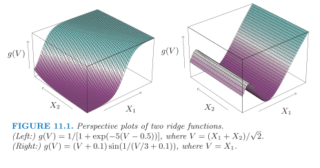

# Week 11

## Projection Pursuit Regression

Projection pursuit regression (PPR) is a statistical model that extends [additive models](stat541_week9.md#generalized-additive-models-gams). This model adapts the additive models in that it first projects the design matrix of features in the optimal direction before applying smoothing functions.

Assume we have an input vector $X\in \mathbb{R}^p$, and a target $Y$. Let $\omega_m\in \in \mathbb{R}^p, m=1,2, \ldots, M$, be unit vectors of unknown parameters. The PPR model has the form

$$
f(X)=\sum_{m=1}^M g_m\left(\omega_m\cdot X\right).
$$

This is an additive model, but in the derived features $V_m=\omega_m^T X$ rather than the inputs themselves. The functions $g_m$ are unspecified and are estimated along with the directions $\omega_m$ using some flexible smoothing method.

### Ridge Functions

The function $g_m\left(\omega_m\cdot X\right)$ is called a ridge function in $\mathbb{R}^p$. It varies only in the direction defined by $\omega_m$. The scalar variable $V_m$ is the projection of $X$ onto the unit vector $\omega_m$, and we seek $\omega_m$ so that the model fits well, hence the name "projection pursuit." Figure 11.1 shows some examples of ridge functions. In the example on the left $\omega=(1 / \sqrt{2})(1,1)^T$, so that the function only varies in the direction $X_1+X_2$. In the example on the right, $\omega=(1,0)$. 

The PPR model is very general, since forming nonlinear functions of linear combinations generates a surprisingly large class of models. For example, the product $X_1 \cdot X_2$ can be written as $\frac{1}{4}\left(\left(X_1+X_2\right)^2-\left(X_1-X_2\right)^2\right)$.

**Remarkable fact:** If $M$ is taken arbitrarily large, for appropriate choice of $g_m$ the PPR model can approximate any continuous function in $\mathbb{R}^p$ arbitrarily well(1). 
{.annotate}

1. Such a class of models is called a universal approximator. However this generality comes at a price. Interpretation of the fitted model is usually difficult, because each input enters into the model in a complex and multifaceted way. As a result, the PPR model is most useful for prediction, and not very useful for producing an understandable model for the data. 

### How to Fit the PPR Model

How do we fit a PPR model, given training data $\left(x^{(i)}, y^{(i)}\right), i=1,2, \dots, n$? We seek the approximate minimizers of the error function

$$
\sum_{i=1}^n\left(y^{(i)}-\sum_{m=1}^M g_m\left(\omega_m\cdot x^{(i)}\right)\right)^2
$$

over $g_m$ and $\omega_m, m=1,2, \dots, M$. 

Consider just one term ( $M=1$, and drop the subscript):

- Given the direction vector $\omega$, we form the derived variables $v_i=\omega^T x_i$. Then we have a one-dimensional smoothing problem, and we can apply any scatterplot smoother, such as a smoothing spline, to obtain an estimate of $g$. 

- Given $g$, we want to minimize the error function over $\omega$, where a Gauss-Newton search (see p.391, ESL) is convenient. 

These two steps, estimation of $g$ and $\omega$, are iterated until convergence. 

With more than one term in the PPR model, the model is built in a forward stage-wise manner(1), adding a pair $\left(\omega_m, g_m\right)$ at each stage.
{.annotate}

1. Forward stagewise modeling approximates the solution to the minimization of the error function $\displaystyle \min_{g_m,\omega_m} \sum_{i=1}^n\left(y^{(i)}-\sum_{m=1}^K g_m\left(\omega_m\cdot x^{(i)}\right)\right)^2$, $1\leq K\leq M-1$, by sequentially adding new basis functions $g_{K+1}\left(\omega_{K+1}\cdot x^{(i)}\right)$ to the minimization without adjusting the parameters of those that have already been added. For more details see Section 10.3, ESL. 

### Implementation Details

There are a number of implementation details:

- After each step the $g_m$ 's from previous steps can be readjusted using backfitting. (While this may lead ultimately to fewer terms, it is not clear whether it improves prediction performance.)
- Usually the $\omega_m$ are not readjusted (partly to avoid excessive computation), although in principle they could be as well.
- The number of terms $M$ is usually estimated as part of the forward stage-wise strategy. The model building stops when the next term does not appreciably improve the fit of the model. Cross-validation can also be used to determine $M$.