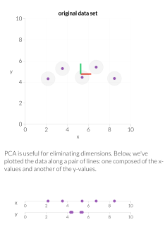

# Week 13

## Principal Component Analysis (PCA)

PCA is a method for dimensionality reduction. Start with data, $x^{(i)} \in \mathbb{R}^p$ The goal is to convert the data into a lower dimensional space, $\beta^{(i)} \in \mathbb{R}^k$ where $k<p$.(1)
{.annotate}

1. Clustering can also be thought of as dimensionality reduction: $f: x^{(i)}\mapsto \mu_{f(i)}, rather than retaining all $n\times p$ entries $x^{(1)}, \dots, x^{(n)}$, instead represent data by the cluster assignment $f$ and $k\times p$ entries $\mu_1, \dots, \mu_k$. 

First we fix a $k$ that reprents the dimension of the affine subspace onto which we want to project.

**Definition**  Affine Subspace:
An affine subspace is a translation of a vector subspace. Formally, a set $S$ is an affine subspace if there exists a vector space $V$ and a point $x_0 \in S$ such that $S=x_0+V$. In other words, $S$ is the set of all points that can be written as $x_0+v$ for some $v \in V$.

To find the affine subspace, $u+W$, we can formulate two equivalent optimization problems:

**Variance Maximization:** We can maximize the variance of the projected $x^{(i)}$'s.(1) Let $P_{u, W}\left(x^{(i)}\right)$ denote the projection onto the affine space $u+W$. We want to maximize the variance of the projected data. (For this maximization see [Problem 2(a-d)](stat541_assignment5.md#assignment-5).) 
{.annotate}

1. The variance of the projected $x^{(i)}$'s indicates how much information we preserved from the original data. For example, in the following figure. The projected $x^{(i)}$'s onto $x$-axis have larger variance than those onto $y$-axis. 

**Distance Minimization:** We can find the least squares error of the projection (i.e. minimizing the distance between $x^{(i)}$'s and their projections). Let $P_{u, W}\left(x^{(i)}\right)$ denote the projection onto the affine space $u+W$. We want to minimize the least squares error of the projected data:

$$
\operatorname*{arg\, min}_{u, W} \sum_{i=1}^{n}\left\|x^{(i)}-P_{u, W}\left(x^{(i)}\right)\right\|^2.
$$

### Find the Affine Subspace

If we once again let $P_{u, W}(x)=u+w$, for some $w \in W$, we can choose an orthonormal basis for $W$, then put this basis into the columns of $V \in \mathbb{R}^{p \times k}$. We can then find a $\beta$ such that $w=V \beta$. That is, $w$ is some linear combination of the columns of $V$. We can then write the projection as:

$$
P_{u, W}(x)=u+w=u+V \beta. 
$$

Then to find the affine subspace with the least squares error of the projection, we only need to find the vector $u$ and the orthogonal matrix $V$. 

Now we have

$$
\operatorname*{arg\, min}_{u, V} \sum_{i=1}^{n}\left\|x^{(i)}-P_{u, W}\left(x^{(i)}\right)\right\|^2=\operatorname*{arg\, min}_{u, V} \sum_{i=1}^{n}\left\|\left(x^{(i)}-u\right)-V\beta\right\|^2. 
$$

Finding the $\beta$ minimizing this square loss error, is a regression problem and we get

$$
\hat{\beta}=\left(V^T V\right)^{-1} V^T\left(x^{(i)}-u\right)=V^T\left(x^{(i)}-u\right).
$$

Plugging this back into the equation, we get:

$$
\begin{aligned}
&\operatorname*{arg\, min}_{u, V}  \sum_{i=1}^{n}\left\|x^{(i)}-P_{u, W}\left(x^{(i)}\right)\right\|^2 \\
= &\operatorname*{arg\, min}_{u, V}  \sum\left\|x^{(i)}-u-V V^T\left(x^{(i)}-u\right)\right\|^2 \\
= &\operatorname*{arg\, min}_{u, V}  \sum\left\|\left(I-V V^T\right)\left(x^{(i)}-u\right)\right\|^2 \\
= &\operatorname*{arg\, min}_{u, V}  \sum\left(x^{(i)}-u\right)^T\left(I-V V^T\right)^2\left(x^{(i)}-u\right) \\
= &\operatorname*{arg\, min}_{u, V}  \sum\left(x^{(i)}+\bar{x}-\bar{x}-u\right)^T\left(I-V V^T\right)^2\left(x^{(i)}+\bar{x}-\bar{x}-u\right) \\
= &\operatorname*{arg\, min}_{u, V}  \left({\color{red} \sum\left(x^{(i)}-\bar{x}\right)^T\left(I-V V^T\right)^2\left(x^{(i)}-\bar{x}\right)} + {\color{green} \sum(\bar{x}-u)^T\left(I-V V^T\right)^2(\bar{x}-u)}\right. \\
&\quad \left. - {\color{blue} \sum\left(x^{(i)}-\bar{x}\right)^T\left(I-V V^T\right)^2(\bar{x}-u)} - {\color{blue} \sum(\bar{x}-u)^T\left(I-V V^T\right)^2\left(x^{(i)}-\bar{x}\right)} \right) \\
= &\operatorname*{arg\, min}_{u, V}  {\color{green} \sum(\bar{x}-u)^T\left(I-V V^T\right)^2(\bar{x}-u)},
\end{aligned}
$$

where the ${\color{red}\rm red}$ term is independent of $u,V$, and the two ${\color{blue}\rm blue}$ terms are 0, respectively. Therefore, we only need to minimize

$$
\operatorname*{arg\, min}_{u, V}  \sum_{i=1}^{n}(\bar{x}-u)^T\left(I-V V^T\right)^2(\bar{x}-u). 
$$

**Find the $u$:** Since the matrix $\left(I-V V^T\right)^2$ is positive semi-definite, we can use the fact that the minimum is achieved when the quantity is 0 . Thus, we simply set $u=\bar{x}$. Note that this does not depend on $V$. 

**Find the $V$:** We set the centered matrix as

$$
X_c=\begin{bmatrix}
\left(x^{(1)} - \bar{x}\right)^T \\
\vdots \\
\left(x^{(n)} - \bar{x}\right)^T
\end{bmatrix}, 
$$ 

and assume $X_c$ has the SVD

$$
X_c = UD\tilde{V}^T, 
$$

where the singular values are ordered in decreasing order, i.e. $D = {\rm diag}\{d_{11},\dots,d_{pp}\}$ with $d_{11}\geq d_{22}\geq \dots\geq d_{pp}\geq 0$. And the optimal $V$ is the first $k$ columns of the SVD matrix $\tilde{V}$, denoted as $V_k$. 

### PC Scores and Vectors

The projections onto our space is

$$
\begin{aligned}
\bar{x}+V_k V_k^T\left(x^{(i)}-\bar{x}\right) & =\bar{x}+V_k \hat{\beta}_i \\
& \approx x^{(i)}
\end{aligned}
$$

where, $V_k \hat{\beta}_i=\sum v_j \hat{\beta}_{i j}$. The $\hat{\beta}_i=V_k^T\left(x^{(i)}-\bar{x}\right) \in \mathbb{R}^k$ are called the principal component scores of each data point, $x^{(i)}$. The column vectors of $V_k$ are called the principal component directions. 

We can then rewrite the $\hat{\beta}_i$ 's:

$$
\begin{aligned}
\begin{bmatrix}\hat{\beta}_1, \dots, \hat{\beta}_n\end{bmatrix} 
& =V_k^T X_c^T  =V_k^T\left(U D V^T\right)^T  =V_k^T V D U^T \\
& =\begin{bmatrix}
v_1^T \\
\vdots \\
v_k^T
\end{bmatrix}\begin{bmatrix}
v_1 & \cdots & v_p
\end{bmatrix} D U^T \\
& =\begin{bmatrix}I_k & \vdots & 0\end{bmatrix} D U^T \\
& =D_k U_k^T,
\end{aligned}
$$

where

$$
D_k=\begin{bmatrix}
d_{11} & 0 & \dots & 0 \\
0 & d_{22} & \dots & 0 \\
\vdots & \vdots & \vdots & \vdots \\
0 & 0 & \dots & d_{k k}
\end{bmatrix}, \quad 
U_k=\begin{bmatrix}
u_1 & \dots & u_k
\end{bmatrix}. 
$$

### Choosing K (Dimension of the Subspace)

Consider the sample covariance matrix:

$$
S=\frac{1}{n} \sum_{i=1}^n\left(x^{(i)}-\bar{x}\right)\left(x^{(i)}-\bar{x}\right)^T.
$$

If we run an eigendecomposition on $S=V D^2 V^T$, we have the following:

1. $V=\left[\begin{array}{lll}v_1 & \ldots & v_p\end{array}\right]$, where each $v_i$ is both a PC direction and an eigenvector of $S$.

2. The reconstruction error upon using a $k$-dimensional PCA projection is $\displaystyle \sum_{i=k+1}^p d_{i i}^2$, where $d_{i i}$ are the eigenvalues of $S$.

To find a reasonable dimension $k$, we can form an [elbow plot](stat541_week12.md#choosing-the-number-of-clusters) of the eigenvalues of $S$, and pick the $k$ corresponding with the sharpest elbow.

We can also consider plotting the quantities $\frac{\lambda_i}{\sum \lambda_i}$, where $\lambda_i$ is an eigenvalue of $S$ and choosing $k$ where there is an elbow in the plot once again.