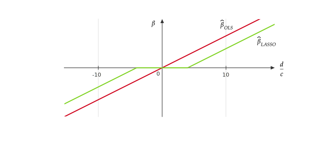

# Week 4

## Ridge Regression

### Motivation 

For polynomial regression, if the degree $d$ is large, prediction can be highly variable. The idea here is to "dampen" the coefficients $\hat{\beta}_i$ in order to constrain higher order terms in the prediction function. 

### Ridge Regression 

Suppose we have a $C>0$ (we assume a proper $C$ is given by an oracle), and we will constrain $\boldsymbol{\beta}$ (here $\boldsymbol{\beta}$ starts from $\beta_1$ rather than $\beta_0$(1)) so that 
{.annotate}

1. In ridge, we don't want to penalize the $\beta_0$ but other $\beta$. 

$$
\|\boldsymbol{\beta}\|^2 = \sum_{i=1}^{p} \beta_i^2 \leq C. 
$$

The ridge regression estimator $\boldsymbol{\beta}_{\rm Ridge}$ is defined as 

$$
\hat{\boldsymbol{\beta}}_{\rm Ridge} = \operatorname*{arg\, min}_{\|\boldsymbol{\beta}\|^2\leq C} \|\boldsymbol{Y} - \boldsymbol{X} \boldsymbol{\beta}\|^2. 
$$

Using Lagrange multiplies to convert the above minimization problem into an equivalent problem: 

$$
\begin{aligned}
\hat{\boldsymbol{\beta}}_{\rm Ridge}
&= \operatorname*{arg\, min}_{\boldsymbol{\beta}\in \mathbb{R}^p} \left(\|\boldsymbol{Y} - \boldsymbol{X} \boldsymbol{\beta}\|^2 + \lambda \left(\|\boldsymbol{\beta}\|^2-C\right)\right) \\
&= \operatorname*{arg\, min}_{\boldsymbol{\beta}\in \mathbb{R}^p} \left(\|\boldsymbol{Y} - \boldsymbol{X} \boldsymbol{\beta}\|^2 + \lambda \|\boldsymbol{\beta}\|^2\right), 
\end{aligned}
$$

where the constant $\lambda>0$ is dependent on $C$. 

Ridge is an example of ERM plus regularization term (or penalty) $\lambda \|\boldsymbol{\beta}\|^2$. The general formulation of ERM + regularization is 

$$
\operatorname*{arg\, min}_{f} \left(\frac{1}{n} \sum_{i=1}{n} L\left(y^{(i)},f(x^{(i)})\right) + \operatorname{Penalty}(f)\right), 
$$

where the $\operatorname{Penalty}(f)$ penalize "complex" $f$ more. 

### Compute the Ridge Estimator

To find $\hat{\boldsymbol{\beta}}_{\rm Ridge}$, we let 

$$
\begin{aligned}
0 
&= \nabla_{\boldsymbol{\beta}}\left(\|\boldsymbol{Y} - \boldsymbol{X} \boldsymbol{\beta}\|^2 + \lambda \|\boldsymbol{\beta}\|^2\right) \\
&= -2\boldsymbol{X}^T\boldsymbol{Y} + 2(\boldsymbol{X}^T\boldsymbol{X})\boldsymbol{\beta} + 2\lambda \boldsymbol{\beta}. 
\end{aligned}
$$

Then we have 

$$
\hat{\boldsymbol{\beta}}_{\rm Ridge} = (\boldsymbol{X}^T\boldsymbol{X}+\lambda I)^{-1} \boldsymbol{X}^T\boldsymbol{Y}, 
$$

where the matrix $\boldsymbol{X}^T\boldsymbol{X}+\lambda I$ is always invertible unlike OLS. 

If assume $\boldsymbol{X}$ has SVD given by $X = UDV^T$, then we have 

$$
\begin{aligned}
\hat{\boldsymbol{\beta}}_{\rm Ridge} 
&= (VDU^TUDV^T+\lambda VV^T)^{-1}VDU^T\boldsymbol{Y} \\
&= (V^T)^{-1}(D^2+\lambda I)^{-1} V^{-1} VDU^T\boldsymbol{Y} \\
&= V(D^2+\lambda I)^{-1} DU^T\boldsymbol{Y}
\end{aligned}, 
$$

where $(D^2+\lambda I)^{-1} D$ is a diagonal matrix given by $diag\{\frac{d_1}{d_1^2+\lambda},\dots,\frac{d_p}{d_p^2+\lambda}\}$ while OLS has $\hat{\boldsymbol{\beta}}_{\rm OLS} = VD^{-1}U^T\boldsymbol{Y}$. Therefore, the coefficients in $\hat{\boldsymbol{\beta}}_{\rm Ridge}$ are usually smaller in magnitude compared to $\hat{\boldsymbol{\beta}}_{\rm OLS}$. 

## Centering and Scaling

Typically, we center our design matrix and response matrix: 

$$
\boldsymbol{Y} = \begin{bmatrix}
y^{(1)} \\
\vdots \\
y^{(n)}
\end{bmatrix}
\xrightarrow{\text{center}}
\boldsymbol{Y}^* = \begin{bmatrix}
y^{(1)} - \bar{y} \\
\vdots \\
y^{(n)} - \bar{y}
\end{bmatrix},
$$

where $\bar{y} = \frac{1}{n}\sum_{i=1}^{n}y^{(i)}$ is the average of the responses, and 

$$
\boldsymbol{X} = \begin{bmatrix}
\mid & & \mid \\
x_{1} & \cdots & x_{p} \\
\mid & & \mid
\end{bmatrix}
\xrightarrow{\text{center}}
\tilde{\boldsymbol{X}} = \begin{bmatrix}
\mid & & \mid \\
x_{1} - \bar{x}_1 & \cdots & x_{p} - \bar{x}_p \\
\mid & & \mid
\end{bmatrix},
$$

where $\bar{x}_i =  \frac{1}{n}\sum_{j=1}^{n}x_j^{(i)}$ is the average of the $i$-th column of $\boldsymbol{X}$(1). We center because we don't want to penalize $\beta_0$. 
{.annotate}

1. Note that there is no column of 1's added in $\boldsymbol{X}$. 

Moreover, we also want to scale  $\tilde{\boldsymbol{X}}$,

$$
\tilde{\boldsymbol{X}} = \begin{bmatrix}
\mid & & \mid \\
\tilde{x}_{1} & \cdots & \tilde{x}_{p} \\
\mid & & \mid
\end{bmatrix}
\xrightarrow{\text{scale}}
\boldsymbol{X}^* = \begin{bmatrix}
\mid & & \mid \\
\frac{\tilde{x}_{1}}{\frac{1}{n}\sum_{j=1}^{n}\tilde{x}_{j1}} & \cdots & \frac{\tilde{x}_{p}}{\frac{1}{n}\sum_{j=1}^{n}\tilde{x}_{jp}} \\
\mid & & \mid
\end{bmatrix}.
$$

We scale so all of the features have the same magnitude. 

After centering and scaling, we run ridge regression using the response $\boldsymbol{Y}^*$ and the design $\boldsymbol{X}^*$. When new data points come in, we do the centering and scaling using the $\bar{y}$, $\bar{x}_i$, and $\frac{1}{n}\sum_{j=1}^{n}\tilde{x}_{ji}$ of the training data. 

## LASSO (Least Absolute Shrinkage and Selection Operator)

LASSO is another method of ERM + regularization, which is also given by two formulations:

**Constrain Formulation**

$$
\hat{\boldsymbol{\beta}}_{\rm LASSO} = \operatorname*{arg\, min}_{\|\boldsymbol{\beta}\|_1\leq C} \|\boldsymbol{Y} - \boldsymbol{X} \boldsymbol{\beta}\|^2.
$$

**Constrain Formulation**

$$
\hat{\boldsymbol{\beta}}_{\rm LASSO} = \operatorname*{arg\, min}_{\boldsymbol{\beta}\in \mathbb{R}^p} \left(\|\boldsymbol{Y} - \boldsymbol{X} \boldsymbol{\beta}\|^2 + \lambda \|\boldsymbol{\beta}\|_1\right),
$$

where $\|\boldsymbol{\beta}\|_1 = \sum_{i=1}^p |\beta_i|$. 

For $p=2$ and $C=1$, the constraints of ridge and LASSO are respectively $L^2$ and $L^1$ balls, and the (contour of) corresponding objective functions are shown as follows.

The $L^1$ ball can usually impose sparsity (occurrence of zeros(1)) in the LASSO coefficient estimate, and thus LASSO does variable selection. 
{.annotate}

1. In practice, the contour of the objective function usually intersects with the $L^1$ ball at vertices. 

### LASSO with $p=1$

For $p=1$, find the LASSO estimate

$$
\operatorname*{arg\, min} \sum_{i=1}^{n} (\tilde{y}^{(i)} - \beta \tilde{x}^{(i)})^2 + \lambda|\beta|,
$$

where $\tilde{y}^{(i)} = y^{(i)}-\bar{y}$ and $\tilde{x}^{(i)} = x^{(i)} - \bar{x}$. 

For $\beta>0$, 

$$
\begin{aligned}
\frac{\mathrm{d}}{\mathrm{d} \beta} \left(\sum_{i=1}^{n} (\tilde{y}^{(i)} - \beta \tilde{x}^{(i)})^2 + \lambda|\beta|\right)
&= \frac{\mathrm{d}}{\mathrm{d} \beta} \left(\beta^2\sum_{i=1}^{n}(\tilde{x}^{(i)})^2 - 2\beta\sum_{i=1}^{n}\tilde{x}^{(i)}\tilde{y}^{(i)} + \lambda\beta\right) \\
&= 2\beta c- 2d + \lambda = 0,
\end{aligned}
$$

where $c = \sum_{i=1}^{n}(\tilde{x}^{(i)})^2$ and $d = \sum_{i=1}^{n}\tilde{x}^{(i)}\tilde{y}^{(i)}$. Then, we have 

$$
\beta = \frac{d}{c} - \frac{\lambda}{2c}. 
$$

Similarly, for $\beta<0$, we have 

$$
\beta = \frac{d}{c} + \frac{\lambda}{2c}. 
$$

Therefore, the LASSO estimator for $p=1$ is given by

$$
\begin{aligned}
\hat{\beta}_{\rm LASSO} 
&= \left\{\begin{matrix}
\frac{d}{c} - \frac{\lambda}{2c} \quad &\text{ if } \frac{d}{c} - \frac{\lambda}{2c} > 0, \\
\frac{d}{c} + \frac{\lambda}{2c} \quad &\text{ if } \frac{d}{c} + \frac{\lambda}{2c} < 0, \\
0\quad &\text{otherwise,}
\end{matrix}
\right. \\
&= \operatorname*{sgn}(\frac{d}{c})\cdot \max\{0,\left|\frac{d}{c}\right|-\frac{\lambda}{2c}\}.
\end{aligned}
$$

The following figure illustrates the difference of the OLS estimator and LASSO estimator, where we can see $\hat{\beta}_{\rm LASSO}$ applies a soft threshold to $\pm\frac{\lambda}{2c}$(1).
{.annotate}

1. Compared to the soft threshold, a hard threshold would show "jumps" in figures, which indicates the function is not continuous. 

For more features, we may use a coefficient plot with respect to $\lambda$, i.e. $\beta_i$-$\lambda$ plot(1).  As $\lambda$ grows, the later a $\beta_i$ becomes 0, the more important this corresponding feature should be as it remains in our model even with large penalty. 
{.annotate}

1. For $p=1$, $\beta$ is linear with respect to $\lambda$. For $p>1$, we may choose a proper transformation (using parameters like $d$ and $c$) of $\lambda$ to make the coefficient plot piecewise linear as the figure below. 

### Group LASSO

Suppose our regression coefficients $\boldsymbol{\beta}$ is partitioned into groups as 

$$
\boldsymbol{\beta} = \begin{bmatrix}
\beta^{(1)} \\
\vdots \\
\beta^{(k)}
\end{bmatrix},
$$

where $\beta^{(i)}\in \mathbb{R}^{p_i}$. We may want to set entire groups of coefficients $\beta^{(i)}$ to zero. Then we introduce the penalty

$$
\hat{\boldsymbol{\beta}}_{\rm Group} = \operatorname*{arg\, min}_{\boldsymbol{\beta}\in \mathbb{R}^p} \left(\|\boldsymbol{Y} - \boldsymbol{X} \boldsymbol{\beta}\|^2 + \sum_{i=1}^{k} \lambda_i\|\beta^{(i)}\|\right),
$$

where $\|\beta^{(i)}\| = \sqrt{\sum_{j=1}^{p_i}(\beta^{(i)}_j)^2}$. 

## Data Splitting and Cross-Validation

Suppose we have two classes of functions (or models or learning algorithms) $\mathcal{F}_1$ and $\mathcal{F_2}$. We may not want to use the empirical risk, based on the whole data set, to evaluate these two classes. This is because we use the data set to fit our model under the guidance of [ERM](stat541_week1.md#empirical-risk-minimization-erm), and therefore, the model from a more complex class will achieve a lower empirical risk on this exactly same data set(1). 
{.annotate}

1. An extreme example: we fit the data set using a very high degree polynomial, and we will find a zero-ERM polynomial model. If we follow the standard of ERM, this should be THE BEST model, which is clearly not the case. 

Solution is to split the data into training set and a validation set: 

$$
\underbrace{\left(x^{(1)},y^{(1)}\right),\dots,\left(x^{(k)},y^{(k)}\right)}_{\text{Training Set } \mathcal{D}_{\rm Train}},\underbrace{\left(x^{(k+1)},y^{(k+1)}\right),\dots,\left(x^{(n)},y^{(n)}\right)}_{\text{Validation Set } \mathcal{D}_{Valid}}. 
$$

More precisely, our objective is to estimate $R(\hat{f}_i,P)$, $\hat{f}_i\in \mathcal{F}_i$, and find the model $i$ that minimizes, which is achieved by the following steps: 

1. Fit $\hat{f}_i\in \mathcal{F}_i$ via ERM (or another method) using only the data in $\mathcal{D}_{\rm Train}$. 

2. Compute 
$\displaystyle \frac{1}{|\mathcal{D}_{\rm Valid}|} \sum_{\left(x^{(i)},y{(i)}\right)\in \mathcal{D}_{\rm Valid}} L\left(\hat{f}_i(x^{(j)}),y^{(j)}\right).$

3. Find the model $i$ that minimizes Step 2. 

4. Usually, we then fit $\hat{f}$ using the model in Step 3 on the entire data set $\mathcal{D}_{\rm Train}\cup \mathcal{D}_{\rm Valid}$. 

If we consider the expected value of empirical risk conditional on $\mathcal{D}_{\rm Train}$ (in this case, $\hat{f} = \hat{f}_{\rm Train}$ is regarded as fixed, which is obtained by $\mathcal{D}_{\rm Train}$),  we have 

$$
E_{\mathcal{D}_{\rm Valid}}\left(\frac{1}{|\mathcal{D}_{\rm Valid}|} \sum_{\left(x^{(i)},y{(i)}\right)\in \mathcal{D}_{\rm Valid}} L\left(\hat{f}_i(x^{(j)}),y^{(j)}\right) \mid \mathcal{D}_{\rm Train}\right) = R(\hat{f},P),
$$

where in converse, the empirical risk on whole data set, we will underestimate the true risk. 

### Example of Ridge Regression

For each $\lambda$ (or equivalently $C$), we get a class of functions $\mathcal{F}_{C_1},\dots,\mathcal{F}_{C_K}$. For some choices of $C$, if for some $i,j$, $C_i<C_j$, then $\mathcal{F}_{C_i}\subset\mathcal{F}_{C_j}$; similarly, if $\lambda_i<\lambda_j$, then $\mathcal{F}_{\lambda_i}\supset\mathcal{F}_{\lambda_j}$. To find the most reasonable model, we follow the steps below: 

1. Start off with a grid of $\lambda$'s, for instance $\{\lambda_1 = 0.1, \lambda_2 = 1, \lambda_3 = 10, \lambda_4 = 100\}$. 

2. For every $\lambda_i$, find the ridge estimator $\hat{\boldsymbol{\beta}}_{\lambda_i}$ using only the training data. 

3. We compute $\displaystyle \frac{1}{|\mathcal{D}_{\rm Valid}|} \sum_{\left(x^{(i)},y{(i)}\right)\in \mathcal{D}_{\rm Valid}} \left(\left(x^{(j)}\right)^T\hat{\boldsymbol{\beta}}_{\lambda_i} - y^{(j)}\right)^2.$

4. Choose the $\lambda_i$ with the smallest value in Step 3. 

### Proportions to Split

Usually, we take the 80% or 90% of the data set as the training set. 

The larger $\mathcal{D}_{\rm Valid}$ is the lower the variance of $\hat{R}(\hat{f},P)$ is. However, we don't want to take $\mathcal{D}_{\rm Valid}$ too large. This is because if $\mathcal{D}_{\rm Train}$ is small when fitting $\hat{f}$, then $\hat{f}_{\mathcal{D}_{\rm Train}}$ might be very different from $\hat{f}_{\mathcal{D}_{\rm Train}\cup\mathcal{D}_{\rm Valid}}$, which means $\hat{f}_{\mathcal{D}_{\rm Train}}$ is biased. 

### $K$-Fold Cross-Validation 

Split the data into $K$-groups of roughly the same size: 

$$
\mathcal{D} = \left(\mathcal{D}^{(1)}, \underbrace{\mathcal{D}^{(2)}}_{\text{called "folds"}}, \dots, \mathcal{D}^{(K)}\right). 
$$

We estimate $R(\hat{f},P)$ by the following steps: 

1. For $i=1,\dots,K$, fit a model using $\mathcal{D}^{(1)}, \dots, \mathcal{D}^{(i-1)}, \mathcal{D}^{(i+1)}, \dots, \mathcal{D}^{(K)}$ to get $\hat{f}^{(i)}$. 

2. Compute $\displaystyle CV^{(i)} = \frac{1}{|\mathcal{D}^{(i)}|} \sum_{\left(x,y\right)\in \mathcal{D}^{(i)}} L\left(\hat{f}^{(i)}(x),y\right).$

3. Estimate $R(\hat{f},P)\approx \frac{1}{K}\sum_{i=1}^K CV^{(i)} = CV$.

How many folds to choose? Usually $K$ is chosen from 5-10. To show that it may not always be beneficial to choose large $K$, we consider an example of $K=n$ (size of the data set), which is called leave-one-out cross-validation (LOOCV)(1). LOOCV may not always give better estimates of $R(\hat{f},P)$: 
{.annotate}

1. Specifically, for linear regression we can calculate the LOOCV error of $\hat{f}(x) = \boldsymbol{\hat{\beta}}^T x$ without fitting $\hat{f}_i$, which has a closed form expression: $\displaystyle R(\hat{f},P)= \frac{1}{n} \sum_{i=1}^n\left(\frac{y^{(i)} - \left(x^{(i)}\right)^T\hat{\boldsymbol{\beta}} }{1-\left(x^{(i)}\right)^T \left(X^T X\right)^{-1} x^{(i)}} \right)^2$. 

$$
\begin{aligned}
Var(CV) 
&= \frac{1}{K^2} Cov\left(\sum_{i=1}^K CV^{(i)},\sum_{j=1}^K CV^{(j)} \right) \\
&= \frac{1}{K^2}\sum_{i=1}^K\sum_{j=1}^K Cov\left(CV^{(i)},CV^{(j)} \right), 
\end{aligned}
$$

which indicates that if $Cov\left(CV^{(i)},CV^{(j)} \right)=0$ for $i\neq j$, then the larger $K$ is better. However, if $K$ is large, then $\hat{f}^{(i)}\approx\hat{f}^{(j)}$ as the training sets are nearly identical, and thus, $Cov\left(CV^{(i)},CV^{(j)} \right)$ might be large and positive. 