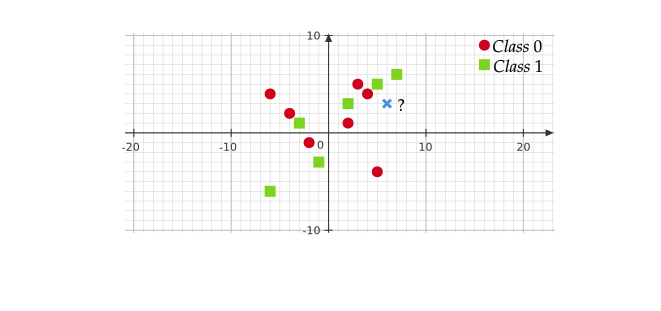
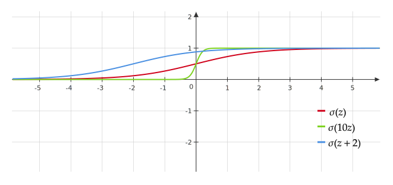
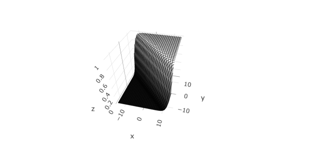

# Week 5

## Classification

Let $\mathcal{Y}$ is a finite set of classes, and for now assume $y^{(i)}\in \{0,1\}$. We want to use $x$ to predict $y$. We assume 

$$
y\mid x \sim {\rm Bernoulli}\left(g(x)\right), 
$$

which is completely general. See an example of this setting in the plane ($p=2$).  

We could try to just do linear regression: under squared error loss, $E(y\mid x)$ is optimal and $E(y\mid x) = g(x)$. However, $g(x)\in [0,1]$ as it's a probability where $x^T\boldsymbol{\beta}$ takes values in $\mathbb{R}$. 

### Logistic Regression

Instead of modeling $y(x)=x^T\boldsymbol{\beta}$, we will assume that the probability $g(x)$(1) is given by
{.annotate}

1. Here $\sigma(x^T\boldsymbol{\beta})$, the probability of $y\mid x$, should be in [0,1], which is easy to verify. 

$$
g(x)=  \sigma(x^T\boldsymbol{\beta}),
$$

where $\sigma$ is the logistic function given by

$$
\sigma(z) = \frac{e^z}{1+e^z} = \frac{1}{1+e^{-z}}. 
$$

 This is called logistic regression model. 

For $p=2$, the logistic function is given by $\sigma(\beta_0 + \beta_1 x_1 + \beta_2 x_2)$. The following figure shows an example of $\sigma(x+y)$.  

### Motivation and Interpretation

On one hand, $\sigma$ is differentiable and easy to compute with. On the other hand, logistic regression assumes log-odds ratio(1) is a linear function. 
{.annotate}

1. The log-odds ratio is the natural logarithm of the odds ratio. An odds ratio (OR) is a statistic that quantifies the strength of the association between two events, A and B. The odds ratio is defined as the ratio of the odds of event A taking place in the presence of B, and the odds of A in the absence of B. Two events are independent if and only if the OR equals 1, i.e., the odds of one event are the same in either the presence or absence of the other event. If the OR is greater than 1, then A and B are associated (correlated) in the sense that, compared to the absence of B, the presence of B raises the odds of A, and symmetrically the presence of A raises the odds of B. Conversely, if the OR is less than 1, then A and B are negatively correlated, and the presence of one event reduces the odds of the other event occurring.

A more insightful motivation is shown below: 

<embed src="https://shx-haah.github.io/notes/lecture_notes/stat541_logistic_fnc_motivation.pdf" type="application/pdf" width="100%" height="750px"/>

### Procedure of Logistic Regression

How to use logistic regression for prediction:

1. Get training data $(x^{(1)}, y^{(1)}),(x^{(2)}, y^{(2)})\dots$

2. Use training data to select a $\hat{\beta}$, i.e. fit our model to the training data. 

3. Get a new $x$ want to predict the class of $y$: Compute the estimated probability $\displaystyle \sigma (\hat{\beta}^T x) = \frac{e^{\hat{\beta}^T x}}{1 + e^{\hat{\beta}^T x}}$. 
    - If $\sigma (\hat{\beta}^T x)>0.5$, predict that $y$ is in class $1$.  

    - If $\sigma (\hat{\beta}^T x)<0.5$, predict that $y$ is in class $0$.  

This procedure is designed to minimize the misclassification error. However, some errors are "worse" than others. For example, for a spam email filter, misclassifying spams as normal emails is unlikely to cause big issue, but it may be terrible in the opposite. To account for this we can modify the 0.5 threshold into a larger number (such as 0.95) when predicting a email to be a spam.(1)
{.annotate}

1. This means the filter is surely confident when classify some email as spam.

### Multinomial Regression

Let $y^{(i)}$ takes on value from multiple classes, we say $K$-class, and we assume 

$$
y\mid x \sim {\rm Multinomial}_K\left(p_1(x), p_2(x), \dots, p_K(x)\right).  
$$

For $p$ features, we assume $x=(1, x_1,\dots, x_p)$. Then the multinomial regression is given by 

$$
\begin{aligned}
& p_1(x) = \frac{\exp\left(\left(\beta^{(1)}\right)^T x\right)}{1 + \sum_{j=1}^{K-1}\exp\left(\left(\beta^{(j)}\right)^T x\right)}, \\
& \quad \vdots \\
& p_{K-1}(x) = \frac{\exp\left(\left(\beta^{(K-1)}\right)^T x\right)}{1 + \sum_{j=1}^{K-1}\exp\left(\left(\beta^{(j)}\right)^T x\right)}, \\
& p_{K}(x) = \frac{1}{1 + \sum_{j=1}^{K-1}\exp\left(\left(\beta^{(j)}\right)^T x\right)}, 
\end{aligned}
$$

where we regard the $K$-th class as the baseline class. It is easy to see $p_1,\dots, p_K$ are valid probabilities(1). A function with a form of $p_1,\dots, p_{K-1}$ is called softmax function.   
{.annotate}

1. Non-negative and the sum is 1. 

### Calculate the Estimator 

We use [maximum likelihood](/notes/lecture_notes/stat541_week3/#recap-on-likelihood-function) to estimate $\beta$ to get $\hat{\beta}$. We take $K=2$ as an example.

Assume $y\mid x \sim {\rm Bernoulli}\left(\pi\right)$, i.e. $Pr(y) = \pi^y(1-\pi)^{1-y}$. To apply logistic regression, we assume $y^{(i)}\sim {\rm Bernoulli}\left(\sigma \left((x^{(i)})^T \beta\right)\right)$. Then the log-likelihood function is 

$$
\begin{aligned}
L(\beta) 
&= \sum_{i=1}^n \ln \left(Pr(y^{(i)\mid x^{(i)},\beta})\right) \\
&= \sum_{i=1}^n y^{(i)} \ln\left(\sigma \left((x^{(i)})^T \beta\right)\right) + \sum_{i=1}^n (1-y^{(i)})\ln \left(1- \sigma \left((x^{(i)})^T \beta\right)\right). 
\end{aligned}
$$

Then the MLE is defined as 

$$
\hat{\beta}_{\rm MLE} = \operatorname*{arg\, max} L(\beta) = \operatorname*{arg\, min} (-L(\beta)). 
$$

Unfortunately, unlike linear regression, $\nabla L(\beta)$ here has no closed-form. Therefore, we may apply some other optimization method, such as gradient descent and Newton Raphson Algorithm(1). 
{.annotate}

1. Reference: 刘浩洋, 户将, 李勇锋, 文再文, 最优化：建模、算法与理论, 高教出版社. For GD see section 6.2, and for NR see section 6.4.

Brief comparison of GD and NR: 

- **NR** Usually takes more intelligent steps than GD. 

- **NR** There is no tuning required while in GD we have to tune the step size. 

- **Problem with NR** We have to invert the the Hessian matrix at each step. Inverting such a matrix has complexity $O(p^3)$. For GD we only have to compute the gradient, which has complexity $O(p)$.  