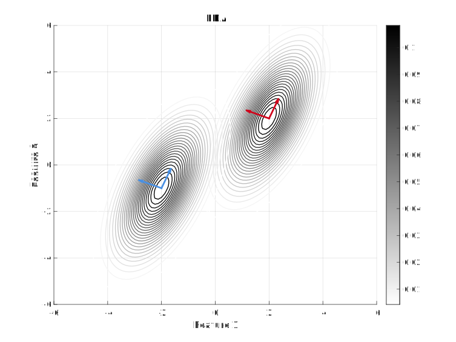
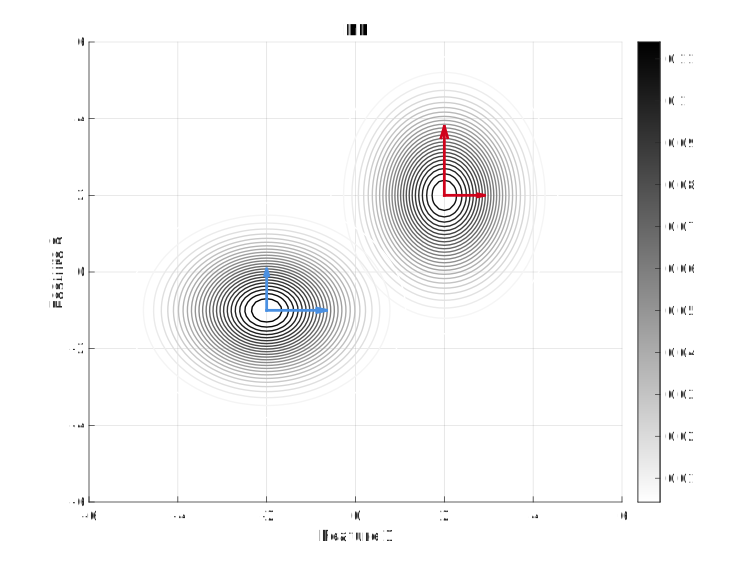
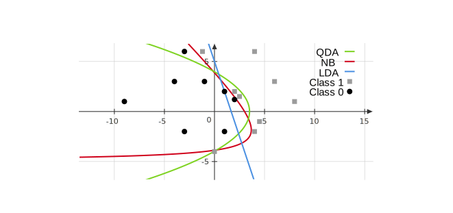

# Week 6

## Generative Models for Classification

For classification(1), [logistic regression](stat541_week5.md#logistic-regression) involves directly modeling $g(x)$ (i.e.  $Pr(y=1\mid x)$) using the logistic function. We now consider an alternative and less direct approach to estimating these probabilities -- we model the distribution of the feature in each of the response classes, i.e. $p(x\mid y)$ for each $y\in \mathcal{Y}$. We then use Bayes’ theorem to flip these around into estimates for $Pr(y = 1 \mid x)$(2).
{.annotate}

1. For simplicity, we assume $\mathcal{Y}=\{0,1\}$ and $\mathcal{X}=\mathbb{R}$ in this paragraph. 

2. This requires the knowledge of $Pr(x)$ and $Pr(y)$ for each $x\in \mathcal{X}, y\in \mathcal{Y}$. We can either choose $Pr(y)$ to be the proportion of each class among the whole data set, or regard it as unknown parameters which we will estimate later. As for $Pr(x)$, since our goal is to give the best prediction for new data, this term will be canceled while comparing different predictions. 

Compared with discriminative models(1), where we model $p(y\mid x)$ and use it to predict, for generative models, we model $p(y,x)$ and then use it to compute $p(y\mid x)$ for predictions. 
{.annotate}

1. Discriminative models, also referred to as conditional models, studies the ${\displaystyle P(y|x)}$ or maps the given unobserved variable (target) $x$ to a class $y$ dependent on the observed variables (training samples). Types of discriminative models include logistic regression, conditional random fields, decision trees among many others. 

Specifically, we model 

$$
p(y,x) = p(x\mid y)p(y) = p(y\mid x) p(x), 
$$

and want to obtain $p(y\mid x)$ from this. Therefore, we need to specify a distribution for $p(x\mid y)$: assume that $x\in \mathbb{R}^p$ and is continuous, and $(x\mid y)$ follows certain Gaussian distributions. There are three kinds of assumptions on Gaussian distributions: quadratic discriminant analysis (QDA), linear discriminant analysis (LDA), and naive Bayes (NB). 

## QDA, LDA, and Naive Bayes

Model assumptions (figures below show the Contour of $x\mid y$ with $p=2$ and $y$ in two different classes):

- QDA assumes that $\displaystyle x\mid y=j \sim \mathcal{N}_p(\mu_j, \Sigma_j)$. 

- LDA assumes that $\displaystyle x\mid y=j \sim \mathcal{N}_p(\mu_j, \Sigma)$, where $\Sigma$ is the common covariance matrix across all classes. 

- Naive Bayes assumes that $\displaystyle x\mid y=j \sim \mathcal{N}_p(\mu_j, D_j)$, where $D_j$ is diagonal for every class. This implies that the individual features are independent given $y$. For NB, the eigenvectors of the covariance matrices are parallel to the axes. 

Among the three models, QDA is the most complicated; LDA and NB are different -- one is not more complicated than the other. 

## Procedure of Prediction

We assume $y$ takes in $K$-classes following multinomial distribution

$$
y \sim {\rm Multinomial}_K(\pi), 
$$

where $\pi = \left(Pr(y=1),\dots,Pr(y=K)\right)$ is a probability vector.

1. Choose a model QDA, LDA, or NB with unknown parameters $\theta = \pi, \mu_j, \Sigma_j$ for $j=1,\dots, p$.  

2. Find estimates of the unknown parameters using MLE. 

3. Compute $\displaystyle p(y\mid x,\hat{\theta})$ and use this for classification. 

### Estimate Parameters

In QDA, the likelihood looks like 

$$
\begin{aligned}
L(\theta) 
&= \prod_{i=1}^{n} p\left(x^{(i)}, y^{(i)}\mid \theta\right) \\
&= \prod_{i=1}^{n} p\left(x^{(i)}\mid y^{(i)}, \theta\right) p(y^{(i)}\mid \theta) \\
&= \prod_{i=1}^{n} \prod_{j=1}^{K} \left(\frac{1}{\sqrt{(2\pi)^p \operatorname{det}(\Sigma_j)}} \exp \left(-\frac{1}{2}\left(x^{(i)}-\mu_j\right)^T\Sigma_j^{-1}\left(x^{(i)}-\mu_j\right)\right)\pi_j\right)^{I(y^{(i)}=j)}. 
\end{aligned}
$$

Maximizing this with respect to $\pi, \mu_j, \Sigma_j$ for $j=1,\dots, p$, we obtain: denoting $n_j = \sum_{i=1}^n I(y^{(i)}=j)$, 

$$
\begin{aligned}
\hat{\pi_j} &= \frac{n_j}{n}, \\
\hat{\mu_j} &= \frac{1}{n_j} \sum_{i\mid y^{(i)}=j} x^{(i)}, \\
\hat{\Sigma_j} &= \frac{1}{n_j}\sum_{i\mid y^{(i)}=j} \left(x^{(i)}-\hat{\mu_j}\right)\left(x^{(i)}-\hat{\mu_j}\right)^T, 
\end{aligned}
$$

where $\hat{\pi_j}$ is the proportion of $\{y^{(i)}\}$ in class $j$, and $\hat{\Sigma_j}$ is the sample covariance matrix(1) of all observations in class $j$. 
{.annotate}

1. A sample of numbers is taken from a larger population of numbers, where "population" indicates not number of people but the entirety of relevant data, whether collected or not. The sample mean is the average value of the sample. **The sample covariance** is useful in judging the reliability of the sample means as estimators and is also useful as an estimate of the population covariance matrix. 

### Compute $p(y\mid x,\hat{\theta})$ and Prediction

For the 3rd step, we need to compute $p(y\mid x,\hat{\theta})$ and make predictions. For a new $x_*$ coming, we predict that $y=j$ if 

$$
p(y=j\mid x_*,\theta) > p(y=l\mid x_*,\theta),
$$

for all $l \neq j$, that is 

$$
\hat{f}(x_*) = \operatorname*{arg\, max}_{j\in \{1,\dots,K\}}\, p(y=j\mid x_*, \theta). 
$$

Computing $p(y=j\mid x, \theta)$ is actually similar with the computation in the [motivation for the logistic function in logistic regression](stat541_week5.md#motivation-and-interpretation). 

$$
\begin{aligned}
p_\theta(y=j\mid x) 
&= \frac{p(y=j,x)}{x}, \\
&= \frac{p(x\mid y=j)p(y=j)}{p(x)} \\
&= \frac{p(x\mid y=j)p(y=j)}{\sum_{l=1}^{K}p(y=l,x)} \\
&= \frac{p(x\mid y=j)p(y=j)}{\sum_{l=1}^{K}p(x \mid y=l) p(y=l)}.
\end{aligned}
$$

For QDA, since $x \mid y=l \sim \mathcal{N}(\mu_l,\Sigma_l)$, we have 

$$
p_\theta(y=j\mid x) = \frac{\frac{1}{\sqrt{(2\pi)^p \operatorname{det}(\Sigma_j)}} \exp \left(-\frac{1}{2}\left(x^{(i)}-\mu_j\right)^T\Sigma_j^{-1}\left(x^{(i)}-\mu_j\right)\right)\pi_j}{\sum_{l=1}^K\frac{1}{\sqrt{(2\pi)^p \operatorname{det}(\Sigma_l)}} \exp \left(-\frac{1}{2}\left(x^{(i)}-\mu_l\right)^T\Sigma_l^{-1}\left(x^{(i)}-\mu_l\right)\right)\pi_l}, 
$$

which is indeed the softmax function we use in logistic regression. 

In fact, we don't need to exactly compute $p_\theta(y=j\mid x)$: we predict $y=j$ if for any $t\neq j$, 

$$
\begin{aligned}
& p(y=j\mid x) > p(y=t\mid x)\\
\Leftrightarrow& \frac{p(y=j,x)}{p(x)}>\frac{p(y=t,x)}{p(x)} \\
\Leftrightarrow& p(y=j,x) > p(y=t,x) \\
\Leftrightarrow& \frac{1}{\sqrt{(2\pi)^p \operatorname{det}(\Sigma_j)}} \exp \left(-\frac{1}{2}\left(x^{(i)}-\mu_j\right)^T\Sigma_j^{-1}\left(x^{(i)}-\mu_j\right)\right)\pi_j > \frac{1}{\sqrt{(2\pi)^p \operatorname{det}(\Sigma_t)}} \exp \left(-\frac{1}{2}\left(x^{(i)}-\mu_t\right)^T\Sigma_t^{-1}\left(x^{(i)}-\mu_t\right)\right)\pi_t \\
\Leftrightarrow& \ln \pi_j -\frac{1}{2}\ln \left(\operatorname{det}(\Sigma_j)\right) - \frac{1}{2}(x-\mu_j)^T\Sigma_j^{-1}(x-\mu_j) > \ln \pi_t -\frac{1}{2}\ln \left(\operatorname{det}(\Sigma_t)\right) - \frac{1}{2}(x-\mu_t)^T\Sigma_t^{-1}(x-\mu_t) \\
\Leftrightarrow& {\color{red} \ln \frac{\pi_j}{\pi_t} + \frac{1}{2}\ln \frac{\operatorname{det}(\Sigma_t)}{\operatorname{det}(\Sigma_j)} - \frac{1}{2}\mu_j^T\Sigma_j^{-1}\mu_j + \frac{1}{2} \mu_t^T\Sigma_t^{-1}\mu_t} + x^T{\color{green} \left(\Sigma_j^{-1}\mu_j-\Sigma_t^{-1}\mu_t\right)} + x^T{\color{blue} \left(\Sigma_t^{-1} - \Sigma_j^{-1}\right)}x>0. 
\end{aligned}
$$

Denoting the $\color{red}\text{red}$ term as $c\in\mathbb{R}$, the $\color{green}\text{green}$ term as $b\in\mathbb{R}^p$, and the $\color{blue}\text{blue}$ term as $A\in\mathbb{R}^{p\times p}$, we obtain 

$$
c+b^Tx+x^TAx >0. 
$$

This is called quadratic discriminant analysis assuming that the log odds of the posterior probabilities (i.e. $p(y=j\mid x)$) is quadratic. 

For LDA, since $\Sigma_j=\Sigma_t$ for any $j,t$, we have $A=0$ and the inequality becomes

$$
x^Tb+c>0. 
$$

For NB, since $\Sigma_j$ is diagonal matrix, the term 

$$
x^TAx = \sum_{i=1}^n A_{ii} x_i^2,
$$

where no terms $x_ix_j$ for $i\neq j$ appears in the classifier. 

Based on the above expressions, the decision boundaries between two classes (i.e. the above inequalities becomes equal to 0) of QDA and NB are quadratic and the one of LDA is linear. The following figure shows an example.   

### $K$-Classes Classification Boundaries

For $K>2$, we follow the same classification rule: select (predict) the class $j$ where 

$$
p(y=j\mid x) = \max_{i\in\{1,\dots,n\}} p(y=i\mid x). 
$$

Take $K=3$ as an example. The decision boundaries divide the space into 3 subsets:  

$$
\mathcal{X} = \bigcup_{j\in\{1,2,3\}}\left(\bigcap_{t\neq j}\left\{x\left|\, \right. p(y=j\mid x)>p(y=t\mid x)\right\}\right),
$$ 

which is given by the following figure.  

## Compare with Logistic Regression 

We should choose between LDA, QDA, NB, and Log regression via cross-validation. Generally, it is known that 

- Logistic regression with no feature transformation is similar to LDA. Both give linear decision boundaries. If $p(x\mid y=j)$ is approximately Gaussian, LDA is a bit better. If this fails, logistic regression is better. 

- Logistic regression with quadratic feature transformation (with intersection terms) is similar to QDA. If $p(x\mid y=j)$ is approximately Gaussian, QDA is a bit better. If this fails, logistic regression is better. 

- Logistic regression with quadratic feature transformation (without intersection terms) is similar to NB. If $p(x\mid y=j)$ is approximately Gaussian, NB is a bit better. If this fails, logistic regression is better. 

Generative models are computationally easier than Log regression: To use QDA,LDA, and NB in practice, we estimate $A,b,c$ by plugging the estimators for $\mu,\Sigma,\pi$, which is easy to compute. On the contrast, we need optimization techniques, such as GD and NR, in Log regression.  

QDA can run into problems when some classes only have a few observations as we have to estimate $\Sigma_j$ for each class. For example, consider image classification of animals. Observations $X$ is high dimensional but only a couple of images of Walruses. So $\Sigma_{\rm Walrus}$ is tough to estimate, and QDA performs poorly. 