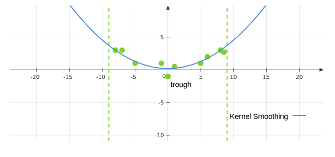
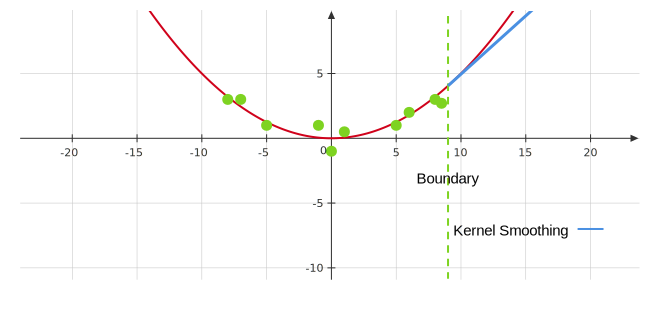

# Week 9

## Local Polynomial Regression

We can think of local polynomial regression as a generalization of kernel smoothing. Given an $x_*$, we want to find $\hat{\beta}_0\left(x_*\right)$ and $\hat{\beta}_1\left(x_*\right)$ using least squares, but we only include data points within a $\lambda$-window of $x_*$. We can write this as:

$$
\min _{\beta_0, \beta_1} \sum_{i=1}^n K_\lambda\left(x_*, x^{(i)}\right)\left(y^{(i)}-\beta_0-\beta_1\left(x_*\right)\right)^2
$$

Once we find $\hat{\beta}_0\left(x_*\right)$, and $\hat{\beta}_1\left(x_*\right)$, we can predict 

$$
\hat{f}\left(x_*\right)=\hat{\beta}_0\left(x_*\right)+\hat{\beta}_1\left(x_*\right)\left(x_*\right)
$$

We do not need to necessarily use a boxcar kernel, we can use any kernel function. We can also incorporate polynomial fits. 

### General Formulation of Local Polynomial Regression

Consider

$$
\begin{aligned}
&\left(\hat{\beta}_0\left(x_*\right), \hat{\beta}_1\left(x_*\right), \dots, \hat{\beta}_d\left(x_*\right)\right) \\
&=\operatorname*{arg\, min}_{\beta_0, \dots, \beta_d} \sum_{i=1}^n K_\lambda\left(x_*, x^{(i)}\right)\left(y^{(i)}-\beta_0-\beta_1\left(x^{(i)}\right)-\dots-\beta_d\left(x^{(i)}\right)^d\right)^2.
\end{aligned}
$$

The prediction is given by 

$$
\hat{f}\left(x_*\right)=\hat{\beta}_0\left(x_*\right)+\sum_{i=1}^d \hat{\beta}_i\left(x_*\right) x_*^i.
$$

The optimization is a weighted least squares problem, which we can formulate by defining $X$ to be the polynomial regression design matrix:

$$
K=\begin{bmatrix}
K_\lambda\left(x_1, x_*\right) & \dots & 0 \\
\vdots & \vdots & \vdots \\
0 & \dots & K_\lambda\left(x_n, x_*\right)
\end{bmatrix}
$$

Then the optimization problem is the same as 

$$
\operatorname*{arg\, min}_\beta(Y-X \beta)^T K(Y-X \beta),
$$ 

where the minimizer is given by

$$
\hat{\beta}=\left(X^T K X\right)^{-1} X^T K Y. 
$$

###  Advantages of Local Regression

- Fit has less bias than kernel smoothing as kernel smoothing will trim peaks and troughs. As averaging the data points within the window, the prediction made by kernel smoothing will be smaller than the highest (larger than the smallest) points, while local regression may achieve lower bias at the minimum or maximum points. 

- A local quadratic regression will have less bias as we fit a quadratic polynomial in the window. 
- Kernel smoothing fails at picking up boundary trends. As kernel smoothing continues linearly, local regression is a bit better. The following figure shows when outside the boundary, kernel smoothing can only will undershoot the trend while local (polynomial) regression can avoid this issue. 

## K-Nearest Neighbors Regression

We want to make a prediction at a point, $x_∗ \in \mathbb{R}$. We will look at the training set, $x^{(1)},\dots,x^{(n)}$ and find the $K$ observations that are closest (smallest values of $|x_*-x^{(i)}|$) to $x_∗$. We can then predict $y_∗$ by averaging over the $K$ observations. In this, $K$ plays a similar role to $\lambda$ in a kernel smoother since it determines the complexity.

### Motivation

If we have a lot of data, and we apply a kernel smoother to one region in the data, where there are sparse amounts of points, only a few points will be captured by the weighting (because the kernel function is small). This gives us a pretty variable fit around that particular region (high variance). In another region where we have lots of points densley sampled, we might want the bandwidth of the kernel to be smaller. That is, we want to use different bandwidths based on how many points are nearby, which is effectively what KNN does. It can be viewed as a kernel smoother where the bandwidth, $\lambda$ depends on $x_*$. 

### KNN as a Smoothing Kernel
1. Define the distance metric, $d\left(x^{(i)}, x_*\right)=\left|x^{(i)}-x_*\right|$.
2. Assume $d\left(x^{(1)}, x_*\right) \leq d\left(x^{(2)}, x_*\right) \leq \ldots \leq d\left(x^{(n)}, x_*\right)$.
3. Let $\lambda\left(x_*\right)=d\left(x^{(k)}, x_*\right)$.
4. Define the kernel function as:

$$
\begin{aligned}
\hat{f}_{\mathrm{KNN}}\left(x_*\right)
&=\frac{\sum_{i=1}^n I\left(d\left(x^{(i)}-x_*\right) \leq \lambda\left(x_*\right)\right) y^{(i)}}{\sum_{i=1}^n I\left(d\left(x^{(i)}-x_*\right) \leq \lambda\left(x_*\right)\right)} \\
&=\frac{1}{K}\sum_i I\left(d\left(x^{(i)}-x_*\right) \leq \lambda\left(x_*\right)\right) y^{(i)}. 
\end{aligned}
$$

We can then write,

$$
\hat{Y}=\begin{bmatrix}
\frac{1}{K} & 0 & \cdots & \frac{1}{K} & 0 & \cdots & 0 \\
0 & \frac{1}{K} & \cdots & 0 & \frac{1}{K} & \cdots & 0 \\
\vdots & \vdots & \ddots & \vdots & \vdots & \vdots & \vdots \\
\vdots & \vdots & \vdots & \vdots & \ddots & \vdots & \vdots \\
\frac{1}{K} & 0 & \cdots & \frac{1}{K} & 0 & \cdots & \frac{1}{K}
\end{bmatrix} \begin{bmatrix}
y^{(1)} \\
y^{(2)} \\
\vdots \\
\vdots \\
y^{(n)}
\end{bmatrix}
$$

Where this matrix has entries of 0 ($n-K$ in total) and $\frac{1}{K}$ ($K$ in total), and there are only $\frac{1}{K}$ on the diagonal. This is a very sparse matrix(1). The effective degrees of freedom is 
{.annotate}

1. Note that the weighting matrix in general will not have strings of repeated $\frac{1}{K}$ in the rows, there may be intermittent 0's.

$$
\operatorname{tr}(W)=\frac{n}{K}. 
$$

This suggests that $K$ should scale proportionally to $n$ to prevent overly complex fits. 

### Advantages of KNN

- With enough data can fit any function and give very flexible fits (may need lots of data). 

- Interpretable (e.g. KNN is easy to make sense of because we’re just taking the $K$ nearest data points and averaging them). 

## Extention to Multivariate Feature Spaces

